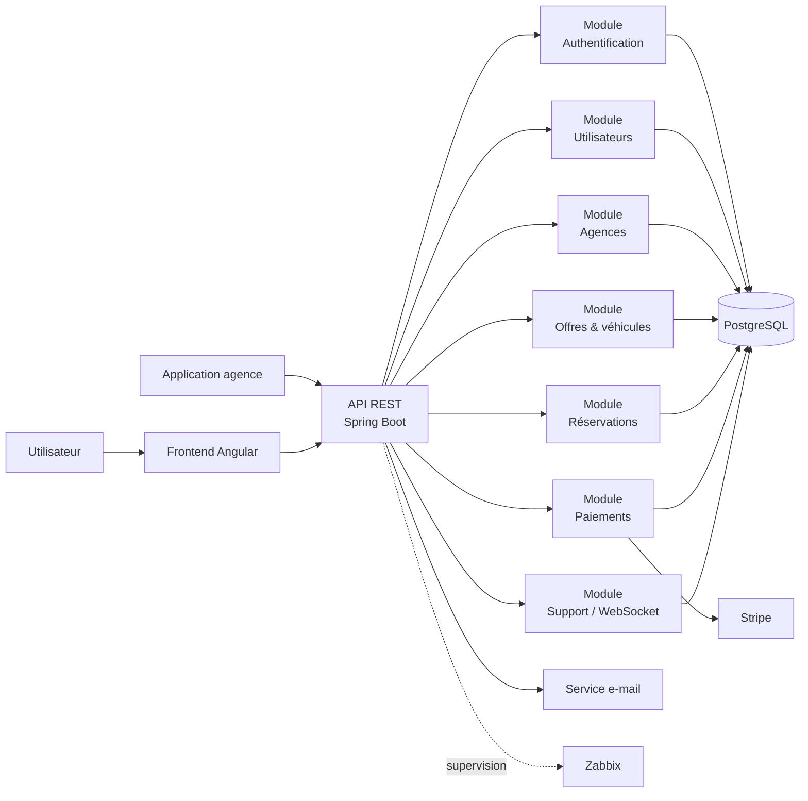
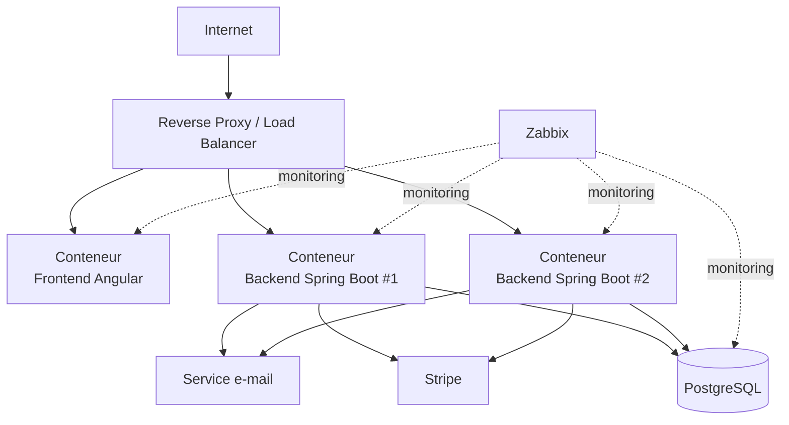

# 3. Conception de l'architecture et choix techniques

## 3.1 Objectifs de l'architecture cible

L'architecture cible doit permettre de répondre aux objectifs fonctionnels et non fonctionnels définis dans le cahier des charges.

Elle doit notamment :

* centraliser les fonctionnalités actuellement réparties entre plusieurs applications nationales ;
* proposer une expérience utilisateur homogène ;
* permettre la gestion des comptes clients ;
* permettre la recherche et la réservation de véhicules ;
* intégrer un paiement en ligne sécurisé ;
* permettre la consultation, la modification et l'annulation des réservations ;
* fournir une API REST sécurisée aux applications des agences ;
* permettre l'intégration d'un service de support par tchat ;
* supporter plusieurs pays, langues, devises et fuseaux horaires ;
* respecter les exigences d'accessibilité ;
* garantir un niveau de sécurité adapté aux données personnelles et aux paiements ;
* supporter une montée en charge progressive ;
* faciliter la supervision et la maintenance ;
* limiter l'impact environnemental de l'application.

L'architecture doit également rester suffisamment simple pour être réalisable dans le cadre du projet de 65 heures.

---

# 3.2 Principes architecturaux

Les principes suivants sont retenus :

### Centralisation

Une application unique remplace progressivement les applications nationales existantes.

Les règles fonctionnelles communes sont donc implémentées une seule fois.

### Modularité

Le backend reste une application unique mais est organisé en modules fonctionnels indépendants :

* authentification et comptes ;
* profils ;
* agences ;
* véhicules et offres ;
* réservations ;
* paiements ;
* support ;
* API agences.

Cette organisation facilite la maintenance et permet une éventuelle évolution future vers des services séparés si cela devenait nécessaire.

### API-first

Les fonctionnalités métier sont exposées par des API REST.

Le frontend Angular et les applications des agences utilisent ces API plutôt que d'accéder directement à la base de données.

### Séparation des responsabilités

Les responsabilités sont séparées entre :

* présentation ;
* logique métier ;
* accès aux données ;
* intégrations externes.

Cette séparation limite le couplage et facilite les tests et la maintenance.

### Sécurité par conception

La sécurité est intégrée dès la conception :

* authentification ;
* autorisation ;
* chiffrement des communications ;
* protection des API ;
* gestion sécurisée des secrets ;
* validation des données ;
* traçabilité des opérations sensibles.

### Scalabilité progressive

L'application doit pouvoir être déployée sur plusieurs instances backend derrière un répartiteur de charge.

La base de données reste centralisée dans un premier temps afin d'éviter une complexité inutile.

---

# 3.3 Architecture applicative cible

L'application est organisée autour de quatre principaux niveaux.

### Frontend

Le frontend Angular constitue l'interface utilisateur.

Il prend en charge :

* navigation ;
* formulaires ;
* recherche ;
* affichage des offres ;
* gestion du compte ;
* réservation ;
* paiement ;
* historique ;
* tchat ;
* internationalisation ;
* accessibilité.

Le frontend communique exclusivement avec le backend via HTTPS.

### Backend

Le backend Spring Boot constitue le cœur métier de l'application.

Il expose des API REST et centralise :

* l'authentification ;
* les règles métier ;
* les réservations ;
* les utilisateurs ;
* les offres ;
* les remboursements ;
* les échanges avec Stripe ;
* l'API destinée aux agences.

### Base de données

PostgreSQL stocke les données métier :

* utilisateurs ;
* profils ;
* agences ;
* véhicules ;
* catégories ACRISS ;
* offres ;
* réservations ;
* paiements ;
* remboursements ;
* échanges nécessaires au support.

### Services externes

Les services externes sont intégrés via des interfaces dédiées :

* Stripe pour le paiement ;
* service d'envoi d'e-mails pour les confirmations ;
* éventuellement un fournisseur d'identité ou de gestion des secrets selon l'environnement cible.

Le backend constitue le point de contrôle de ces intégrations.

---

# 3.4 Organisation modulaire du backend

Le backend Spring Boot est organisé selon les domaines fonctionnels.

```text
backend/
├── auth/
├── user/
├── agency/
├── vehicle/
├── offer/
├── reservation/
├── payment/
├── support/
├── api/
└── shared/
```

Chaque module peut être organisé selon le principe :

```text
Controller
    ↓
Service
    ↓
Repository
    ↓
PostgreSQL
```

Les contrôleurs REST ne contiennent pas les règles métier.

Les règles métier sont regroupées dans les services afin de faciliter leur test et leur évolution.

---

# 3.5 Architecture frontend

Le frontend Angular est organisé par fonctionnalités.

```text
frontend/
├── core/
│   ├── authentication/
│   ├── guards/
│   ├── interceptors/
│   └── services/
│
├── shared/
│   ├── components/
│   ├── forms/
│   └── models/
│
└── features/
    ├── account/
    ├── profile/
    ├── agencies/
    ├── search/
    ├── offers/
    ├── booking/
    ├── reservations/
    ├── payment/
    └── support/
```

Cette organisation permet d'éviter un frontend composé d'un grand nombre de composants fortement couplés.

Angular fournit notamment un système de composants, de routage, de formulaires et d'injection de dépendances adapté à cette organisation modulaire.

---

# 3.6 API REST

Les API REST sont regroupées par domaine fonctionnel.

Exemples :

```text
/api/auth
/api/users
/api/agencies
/api/vehicles
/api/offers
/api/reservations
/api/payments
/api/support
```

Exemples d'opérations :

```text
GET    /api/agencies
GET    /api/offers?departureCity=Paris&...
GET    /api/offers/{id}

POST   /api/reservations
GET    /api/reservations
PUT    /api/reservations/{id}
DELETE /api/reservations/{id}

POST   /api/payments
POST   /api/payments/webhook
```

L'API agence utilise également les ressources REST nécessaires aux opérations CRUD.

L'accès aux API agences est protégé par une authentification dédiée et des autorisations adaptées.

---

# 3.7 Communication entre les composants

Le fonctionnement nominal est le suivant :

```text
Utilisateur
    │
    │ HTTPS
    ▼
Frontend Angular
    │
    │ HTTPS / REST
    ▼
Backend Spring Boot
    │
    ├──────────────► PostgreSQL
    │
    ├──────────────► Stripe
    │
    ├──────────────► Service e-mail
    │
    └──────────────► Service de supervision
```

Les applications des agences suivent un chemin similaire :

```text
Application agence
        │
        │ HTTPS / REST
        ▼
API Spring Boot
        │
        ▼
Services métier
        │
        ▼
PostgreSQL
```

Aucune application cliente ne communique directement avec PostgreSQL.

---

# 3.8 Gestion du paiement

Le paiement est externalisé auprès de Stripe.

Le backend crée un `PaymentIntent` correspondant à la réservation, puis le frontend réalise le parcours de paiement à partir des informations nécessaires fournies par le backend.

Le serveur ne stocke pas les données bancaires sensibles.

Le statut définitif du paiement est synchronisé grâce aux webhooks Stripe.

Cette architecture permet notamment de gérer les paiements nécessitant une authentification supplémentaire et d'éviter de considérer le simple retour du navigateur comme une confirmation définitive du paiement. Stripe recommande l'utilisation des Payment Intents et la surveillance des webhooks pour déterminer qu'un paiement a effectivement abouti.

Le flux est donc :

```text
Angular
   │
   │ demande paiement
   ▼
Spring Boot
   │
   │ création PaymentIntent
   ▼
Stripe
   │
   │ client_secret
   ▼
Angular
   │
   │ confirmation paiement
   ▼
Stripe
   │
   │ webhook
   ▼
Spring Boot
   │
   │ mise à jour
   ▼
PostgreSQL
```

Le webhook Stripe est authentifié et sa signature est vérifiée avant traitement.

---

# 3.9 Gestion du tchat

Le tchat constitue un cas particulier car il nécessite des communications temps réel.

La solution retenue est :

* WebSocket ;
* protocole STOMP ;
* authentification de la connexion ;
* contrôle des autorisations ;
* conservation de l'historique nécessaire.

Le backend reste responsable de l'authentification et de l'autorisation.

Le tchat est intégré comme un module du backend plutôt que comme un microservice indépendant afin de limiter la complexité de la solution.

---

# 3.10 Modèle de données

Le modèle de données est centralisé dans PostgreSQL.

Les principales entités sont :

* `User`
* `Profile`
* `Agency`
* `Vehicle`
* `VehicleCategory`
* `Offer`
* `Reservation`
* `Payment`
* `Refund`
* `ChatConversation`
* `ChatMessage`

Relations principales :

```text
User
 │
 ├──── Profile
 │
 ├──── Reservation
 │
 └──── ChatConversation
              │
              └──── ChatMessage

Agency
 │
 ├──── Vehicle
 │
 └──── Offer
          │
          └──── VehicleCategory

Reservation
 │
 ├──── Offer
 │
 ├──── Payment
 │       │
 │       └──── Refund
 │
 └──── User
```

Le modèle relationnel permet de garantir l'intégrité des données grâce aux clés primaires, clés étrangères, contraintes d'unicité et transactions.

PostgreSQL fournit notamment des mécanismes de transactions permettant de garantir qu'une opération métier composée de plusieurs étapes est exécutée de manière atomique.

Des index seront prévus notamment sur :

* les identifiants ;
* les dates de début et de fin des offres ;
* les villes de départ et de retour ;
* les catégories de véhicules ;
* les identifiants utilisateur ;
* les identifiants de réservation ;
* les statuts de réservation.

La pagination serveur sera utilisée pour les listes importantes afin d'éviter de charger inutilement de gros volumes de données.

---

# 3.11 UML – Diagramme de composants



Ce diagramme représente la structure logique de la solution sans entrer dans les détails d'implémentation.

---

# 3.12 UML – Diagramme de déploiement

La solution est conçue pour être conteneurisée.



Le nombre d'instances backend peut évoluer selon la charge.

L'application backend ne doit donc pas dépendre d'un état stocké uniquement en mémoire locale lorsqu'une fonctionnalité doit fonctionner avec plusieurs instances.

---

# 3.13 Choix technologiques

## Backend : Java / Spring Boot

Spring Boot est retenu pour le backend.

Les raisons principales sont :

* cohérence avec les compétences et l'environnement du projet ;
* forte maturité de l'écosystème Java ;
* support des API REST ;
* intégration avec PostgreSQL ;
* mécanismes de sécurité disponibles ;
* facilité de test ;
* possibilité de conteneurisation ;
* possibilité d'exécuter plusieurs instances.

Spring Boot nécessite Java 17 ou supérieur, ce qui permet de conserver Java 17 comme version de référence du projet.

## Frontend : Angular

Angular est retenu pour le frontend.

Les raisons sont :

* architecture basée sur les composants ;
* organisation adaptée aux applications importantes ;
* routage ;
* formulaires ;
* injection de dépendances ;
* support de l'internationalisation ;
* mécanismes favorisant une architecture modulaire ;
* bonne intégration avec TypeScript.

Angular dispose également de mécanismes intégrés pour l'internationalisation et de protections destinées à réduire certains risques courants côté frontend.

La version exacte sera choisie au démarrage de l'implémentation parmi les versions alors supportées, afin d'éviter de figer inutilement une version obsolète. Angular maintient actuellement des versions avec des périodes Active puis LTS.

## Base de données : PostgreSQL

PostgreSQL est retenu pour :

* sa robustesse ;
* son modèle relationnel ;
* ses transactions ;
* ses contraintes d'intégrité ;
* ses capacités d'indexation ;
* sa compatibilité avec Spring Boot ;
* sa capacité à accompagner la montée en charge.

PostgreSQL dispose également de fonctionnalités avancées d'indexation, de contrôle de concurrence, de sauvegarde et de réplication permettant une évolution future de l'architecture.

## Conteneurisation : Docker

Docker est retenu pour standardiser les environnements :

* développement ;
* test ;
* recette ;
* production.

Les composants principaux peuvent être exécutés dans des conteneurs indépendants.

L'objectif n'est cependant pas de multiplier les conteneurs ou les services inutilement.

## Supervision : Zabbix

Zabbix est retenu pour la supervision de l'infrastructure et des composants applicatifs.

Il permettra notamment de suivre :

* disponibilité ;
* CPU ;
* mémoire ;
* stockage ;
* état des conteneurs ;
* disponibilité HTTP ;
* indicateurs applicatifs exposés pour la supervision ;
* alertes.

Zabbix dispose notamment d'un mécanisme HTTP permettant de contrôler des endpoints HTTP/HTTPS sans agent sur la cible, ainsi que d'un agent permettant de remonter des métriques système.

## Paiement : Stripe

Stripe est retenu comme fournisseur de paiement externe.

Il permet de déléguer la gestion des informations bancaires et de prendre en charge des parcours de paiement nécessitant notamment une authentification forte.

L'intégration repose sur les Payment Intents et les webhooks.

---

# 3.14 Comparaison des architectures

Plusieurs solutions ont été envisagées.

| Critère                         | Monolithe classique | Monolithe modulaire | Microservices |
| ------------------------------- | ------------------: | ------------------: | ------------: |
| Simplicité                      |                  ++ |                  ++ |             - |
| Maintenabilité                  |                   + |                  ++ |            ++ |
| Complexité opérationnelle       |                  ++ |                  ++ |            -- |
| Scalabilité                     |                   + |                  ++ |            ++ |
| Coût de mise en œuvre           |                  ++ |                  ++ |             - |
| Adapté aux 65 h                 |                  ++ |                  ++ |            -- |
| Évolution future                |                   + |                  ++ |            ++ |
| Cohérence avec les besoins YCYW |                   + |              **++** |             + |

### Décision

Le **monolithe modulaire** est retenu.

Il apporte une séparation claire des responsabilités tout en conservant une architecture suffisamment simple à développer, tester et déployer.

Une évolution vers des microservices pourrait être envisagée ultérieurement si certains domaines nécessitaient une scalabilité ou un cycle de déploiement indépendant.

---

# 3.15 Comparaison des bases de données

| Solution   | Avantages                                            | Limites                                            | Décision    |
| ---------- | ---------------------------------------------------- | -------------------------------------------------- | ----------- |
| PostgreSQL | Relationnel, transactions, contraintes, performances | Administration nécessaire                          | **Retenu**  |
| MySQL      | Mature, répandu                                      | Moins adapté à certains besoins avancés            | Alternative |
| MongoDB    | Flexible, modèle document                            | Moins naturel pour les relations métier nombreuses | Non retenu  |

Le domaine YCYW comporte de nombreuses relations fortes entre utilisateurs, réservations, offres, véhicules et agences. Une base relationnelle est donc plus adaptée au modèle métier.

---

# 3.16 Sécurité

La sécurité est intégrée à l'architecture.

### Authentification

Les mots de passe sont stockés sous forme de hash avec **Argon2id**.

Les sessions d'authentification sont protégées et les accès aux ressources sont contrôlés par rôles et permissions.

### API

Les API sont accessibles exclusivement via HTTPS.

Les endpoints sensibles nécessitent une authentification.

Les données entrantes sont validées côté backend.

### Protection des données

Les données personnelles sont limitées aux informations nécessaires au fonctionnement du service.

Les opérations sensibles sont journalisées :

* authentification ;
* modification d'une réservation ;
* annulation ;
* remboursement ;
* suppression d'un compte.

Les secrets techniques ne sont pas stockés dans le code source.

### Paiement

Les données bancaires ne sont pas stockées dans PostgreSQL.

L'application conserve uniquement les identifiants et informations nécessaires au suivi de la transaction.

---

# 3.17 Accessibilité

L'accessibilité est intégrée dès la conception.

Les composants Angular devront respecter notamment :

* navigation complète au clavier ;
* ordre logique du focus ;
* labels explicites ;
* messages d'erreur compréhensibles ;
* alternatives textuelles ;
* contraste suffisant ;
* structure sémantique ;
* compatibilité avec les lecteurs d'écran ;
* absence de dépendance exclusive à la couleur ;
* accessibilité du parcours de paiement ;
* accessibilité du tchat.

L'objectif est de viser **WCAG 2.1 niveau AA** et les exigences du **RGAA 4.1** pour le contexte français.

L'accessibilité sera donc considérée comme une exigence transverse et non comme une fonctionnalité ajoutée en fin de projet.

---

# 3.18 Internationalisation

L'architecture doit permettre de supporter au minimum :

* français ;
* anglais ;
* allemand ;
* espagnol ;
* italien.

Les éléments suivants sont internationalisés :

* textes ;
* dates ;
* heures ;
* nombres ;
* devises ;
* messages d'erreur.

Les dates sont stockées de manière non ambiguë en base et converties selon le fuseau horaire et la locale de l'utilisateur.

---

# 3.19 Performance et scalabilité

Les objectifs définis dans le cahier des charges sont intégrés à l'architecture :

* temps de réponse cible p95 inférieur à 500 ms sur les parcours critiques ;
* capacité cible d'au moins 500 requêtes/seconde ;
* taux d'erreur inférieur à 0,5 % pendant les pics ;
* disponibilité cible de 99,5 %.

Les principaux mécanismes prévus sont :

* indexation PostgreSQL ;
* requêtes ciblées ;
* pagination serveur ;
* cache lorsque nécessaire ;
* lazy loading côté Angular ;
* compression des ressources ;
* optimisation des images ;
* possibilité de multiplier les instances backend.

L'architecture à plusieurs instances implique notamment que le backend soit autant que possible **stateless**.

---

# 3.20 Éco-conception

L'architecture prend en compte la réduction des ressources consommées.

Les principes retenus sont :

* limiter la taille des ressources frontend ;
* compression des images ;
* lazy loading ;
* mise en cache ;
* pagination serveur ;
* limitation des requêtes inutiles ;
* optimisation des requêtes SQL ;
* réduction des échanges réseau ;
* limitation des traitements inutiles côté serveur.

L'objectif défini dans le cahier des charges est notamment d'obtenir un score Lighthouse d'au moins 85 sur desktop et mobile.

---

# 3.21 Plan d'intégration des composants tiers

| Composant            | Rôle              | Communication              | Sécurité                          | Dépendance     |
| -------------------- | ----------------- | -------------------------- | --------------------------------- | -------------- |
| Stripe               | Paiement          | HTTPS / API + Webhooks     | Clés secrètes + signature webhook | Forte          |
| Service e-mail       | Confirmation      | HTTPS/API ou SMTP sécurisé | Authentification                  | Moyenne        |
| Zabbix               | Supervision       | HTTP/agent                 | Réseau interne + authentification | Opérationnelle |
| Navigateur client    | Interface         | HTTPS                      | TLS                               | Forte          |
| Applications agences | Accès aux données | HTTPS / REST               | Authentification API              | Forte          |

Les composants tiers sont volontairement isolés du cœur métier.

Le backend joue le rôle d'intermédiaire afin d'éviter que le frontend ou les applications d'agence aient un accès direct aux services sensibles.

---

# 3.22 Flux de réservation

Le parcours complet est le suivant :

```text
1. Recherche
Utilisateur
    ↓
Angular
    ↓
API /offers
    ↓
PostgreSQL

2. Réservation
Utilisateur
    ↓
Angular
    ↓
API /reservations
    ↓
Spring Boot
    ↓
PostgreSQL

3. Paiement
Angular
    ↓
Spring Boot
    ↓
Stripe PaymentIntent
    ↓
Stripe

4. Confirmation
Stripe
    ↓
Webhook
    ↓
Spring Boot
    ↓
PostgreSQL
    ↓
Confirmation de réservation

5. Notification
Spring Boot
    ↓
Service e-mail
    ↓
Utilisateur
```

Ce flux garantit que la réservation n'est considérée comme définitivement payée qu'après confirmation du paiement par le système de paiement.

---

# 3.23 Cohérence avec les exigences fonctionnelles

| Besoin fonctionnel   | Réponse technique                                     |
| -------------------- | ----------------------------------------------------- |
| Compte utilisateur   | Module User + API REST                                |
| Authentification     | Spring Security + gestion sécurisée des mots de passe |
| Profil               | Module User/Profile                                   |
| Recherche            | API Offers + PostgreSQL + index                       |
| Agences              | Module Agency                                         |
| Véhicules            | Module Vehicle                                        |
| ACRISS               | VehicleCategory                                       |
| Réservation          | Module Reservation                                    |
| Paiement             | Stripe PaymentIntent                                  |
| Confirmation         | Webhook Stripe + service e-mail                       |
| Historique           | PostgreSQL + API REST                                 |
| Modification         | Service Reservation                                   |
| Annulation           | Service Reservation + Refund                          |
| API agences          | API REST sécurisée                                    |
| Tchat                | WebSocket/STOMP                                       |
| Accessibilité        | Angular + règles WCAG/RGAA                            |
| Internationalisation | Angular i18n + données localisées                     |
| Performance          | Index + pagination + cache + optimisation frontend    |
| Scalabilité          | Backend stateless + plusieurs instances               |
| Supervision          | Zabbix                                                |
| Éco-conception       | optimisation frontend/backend                         |

---

# 3.24 Conclusion de l'architecture cible

L'architecture proposée répond aux principaux problèmes identifiés lors de l'audit.

La fragmentation des applications nationales est remplacée par une application centralisée.

La duplication du code est réduite grâce à un backend et un frontend communs.

La fragmentation des données est remplacée par un modèle de données PostgreSQL centralisé.

Les difficultés de déploiement sont réduites grâce à la conteneurisation.

Les problèmes de sécurité sont traités par une politique commune.

La montée en charge est préparée par une architecture backend stateless pouvant être déployée sur plusieurs instances.

Enfin, l'utilisation d'un monolithe modulaire permet de conserver une architecture compréhensible et réalisable dans le cadre du projet, tout en laissant la possibilité de faire évoluer certains modules indépendamment à plus long terme.
