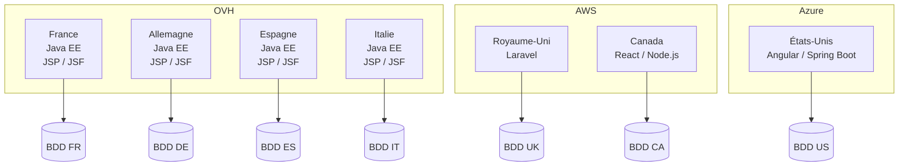

# Audit technique de l'existant

## 1. Introduction

### 1.1 Objectif de l'audit

Your Car Your Way dispose actuellement de plusieurs applications web développées indépendamment pour ses différents marchés.

L'objectif de cet audit est d'analyser l'existant afin d'identifier :

* les forces techniques sur lesquelles l'entreprise peut s'appuyer ;
* les faiblesses et les risques techniques ;
* les contraintes héritées des choix technologiques actuels ;
* les limites en matière de maintenabilité ;
* les limites en matière de performance ;
* les limites en matière de disponibilité et de fiabilité ;
* les limites en matière d'évolutivité.

Cet audit constitue un état des lieux technique. **Il ne définit pas encore l'architecture cible ni les technologies qui seront retenues pour la nouvelle application.**

---

## 1.2 Critères d'évaluation

L'analyse de l'existant est réalisée selon les critères suivants.

### Maintenabilité

La maintenabilité correspond à la capacité à :

* faire évoluer l'application ;
* corriger les anomalies ;
* maintenir les dépendances à jour ;
* déployer les évolutions ;
* conserver une cohérence entre les différentes applications.

### Performance

La performance correspond à la capacité du système à :

* traiter la charge utilisateur ;
* conserver des temps de réponse acceptables ;
* absorber les périodes de forte activité ;
* limiter les erreurs lors des pics de trafic.

### Disponibilité et fiabilité

La disponibilité et la fiabilité sont évaluées à partir notamment :

* du taux de disponibilité ;
* du temps moyen de récupération après incident (MTTR) ;
* du taux de réussite des déploiements ;
* du délai de stabilisation après une mise à jour ;
* des mécanismes de redondance ;
* des mécanismes de sauvegarde et de restauration.

### Évolutivité

L'évolutivité correspond à la capacité de la plateforme à :

* accompagner l'augmentation du nombre d'utilisateurs ;
* augmenter la capacité de traitement ;
* faire évoluer les fonctionnalités ;
* déployer de nouveaux marchés ;
* éviter la multiplication de solutions techniques différentes.

---

# 2. Vue d'ensemble de l'existant

## 2.1 Organisation actuelle

Your Car Your Way dispose de quatre familles d'applications issues de contextes historiques différents :

| Marché      | Front-end | Back-end    | Hébergement                     | Architecture            |
| ----------- | --------- | ----------- | ------------------------------- | ----------------------- |
| France      | JSP / JSF | Java EE     | OVH                             | Monolithe               |
| Allemagne   | JSP / JSF | Java EE     | OVH                             | Monolithe               |
| Espagne     | JSP / JSF | Java EE     | OVH                             | Monolithe               |
| Italie      | JSP / JSF | Java EE     | OVH                             | Monolithe               |
| Royaume-Uni | —         | PHP Laravel | AWS EC2                         | Monolithe               |
| Canada      | React     | Node.js     | AWS                             | Monolithe côté back-end |
| États-Unis  | Angular   | Spring Boot | Azure App Services / Containers | Monolithe               |

Les applications ont été développées indépendamment et utilisent des technologies différentes.

Cette situation résulte principalement de l'évolution historique de l'entreprise, notamment du développement de nouvelles applications ou du rachat de solutions existantes.

---

# 3. Architecture technique actuelle

## 3.1 Architecture globale

L'architecture actuelle repose principalement sur des applications monolithiques.

Les caractéristiques communes identifiées sont :

* applications indépendantes par marché ;
* absence d'une architecture applicative commune ;
* API limitées et hétérogènes ;
* bases de données séparées ;
* schémas de données divergents ;
* absence de mécanisme unifié de partage des informations.

L'architecture globale peut être représentée de manière simplifiée comme suit :

Cette représentation met en évidence la fragmentation actuelle : chaque marché dispose de sa propre application et de son propre environnement de données.

---

# 4. Analyse par application

## 4.1 France — application historique

### Architecture

L'application française constitue la première version du produit.

Elle repose sur :

* Java EE pour le back-end ;
* JSP / JSF pour le front-end ;
* une architecture monolithique ;
* un hébergement sur serveurs OVH ;
* des déploiements manuels.

L'application regroupe notamment :

* authentification ;
* catalogue ;
* réservation ;
* paiement.

### Forces

L'application française présente plusieurs avantages :

* forte maturité fonctionnelle ;
* historique important ;
* base fonctionnelle riche ;
* technologie connue historiquement par l'organisation.

### Faiblesses

Les principales faiblesses identifiées sont :

* stack technique ancienne ;
* architecture monolithique ;
* déploiements manuels ;
* absence de réplication des instances ;
* dépendances présentant un niveau important de vulnérabilités ;
* mécanisme de hashage des mots de passe ancien ;
* utilisation de TLS 1.0 en France ;
* sauvegardes manuelles ;
* restauration non testée.

---

## 4.2 Allemagne, Espagne et Italie

Les applications allemande, espagnole et italienne sont dérivées de l'application française.

Elles utilisent les mêmes fondations techniques :

* Java EE ;
* JSP / JSF ;
* OVH ;
* architecture monolithique.

### Forces

* réutilisation du socle historique ;
* technologies communes entre les quatre applications ;
* mutualisation historique des connaissances techniques.

### Faiblesses

Le code a progressivement été copié et adapté pour répondre aux besoins locaux.

Cette organisation entraîne :

* divergence progressive du code ;
* divergence des fonctionnalités ;
* règles métier différentes selon les pays ;
* difficultés à appliquer une évolution de manière homogène.

Les applications utilisent également des mécanismes anciens de sécurité et de déploiement.

L'Italie utilise notamment encore TLS 1.0.

---

## 4.3 Royaume-Uni

L'application britannique provient du rachat d'un produit existant.

### Technologies

* PHP ;
* Laravel ;
* AWS ;
* instances EC2 classiques.

### Forces

* application plus récente que le socle historique ;
* environnement cloud ;
* infrastructure plus flexible que les environnements OVH historiques ;
* mécanisme de hashage des mots de passe avec bcrypt.

### Faiblesses

L'application reste isolée du reste du système d'information.

Elle possède notamment :

* un modèle de données différent ;
* des règles de réservation différentes ;
* une API non unifiée avec les autres marchés.

La gestion des secrets repose sur des variables d'environnement AWS sans rotation automatisée.

---

## 4.4 Canada

L'application canadienne correspond à une tentative de modernisation.

### Technologies

* React ;
* Node.js ;
* AWS.

### Forces

* expérience utilisateur améliorée ;
* stack front-end moderne ;
* environnement cloud ;
* première tentative d'harmonisation visuelle.

### Faiblesses

La modernisation reste limitée au marché canadien.

Le back-end demeure monolithique.

La solution n'a pas été généralisée aux autres marchés.

La gestion des secrets utilise des variables d'environnement AWS sans rotation automatisée.

---

## 4.5 États-Unis

L'application américaine constitue une expérimentation d'une nouvelle stack.

### Technologies

* Angular ;
* Spring Boot ;
* Azure App Services / Containers.

### Forces

* stack technique plus récente ;
* architecture adaptée à une évolution moderne ;
* application containerisée ;
* utilisation d'Azure ;
* meilleure capacité d'évolution de l'environnement de déploiement.

### Faiblesses

L'expérimentation reste limitée au marché américain.

L'architecture n'a pas été généralisée aux autres pays.

La base de données n'est pas redondante.

Azure Key Vault n'est utilisé que partiellement, uniquement pour l'API.

---

# 5. Analyse de la maintenabilité

## 5.1 Hétérogénéité technologique

L'existant utilise plusieurs technologies :

* Java EE ;
* JSP / JSF ;
* PHP / Laravel ;
* React ;
* Node.js ;
* Angular ;
* Spring Boot.

Cette diversité est le résultat de l'historique des applications.

Elle implique cependant :

* plusieurs environnements de développement ;
* plusieurs compétences techniques nécessaires ;
* plusieurs cycles de mise à jour ;
* plusieurs stratégies de déploiement ;
* plusieurs mécanismes de sécurité ;
* plusieurs modèles de données.

La maintenance globale de la plateforme devient donc plus complexe.

---

## 5.2 Duplication du code

Les applications FR/DE/ES/IT reposent sur un code initial commun qui a été progressivement copié et adapté.

Cette approche permettait historiquement de répondre rapidement aux besoins locaux.

Cependant, elle crée une divergence progressive entre les applications.

Une évolution fonctionnelle ou une correction de sécurité doit donc potentiellement être reproduite dans plusieurs bases de code.

Cela augmente :

* le coût de maintenance ;
* le risque d'oubli ;
* le risque de comportement différent entre pays.

---

## 5.3 Fragmentation des données

Chaque pays dispose de sa propre base de données.

Les schémas sont divergents et il n'existe pas de mécanisme unifié de partage d'information.

Cette organisation complique :

* la consolidation des données ;
* l'évolution des modèles métier ;
* la mise en œuvre de fonctionnalités communes ;
* la cohérence des données entre marchés.

---

## 5.4 Processus de déploiement

Les applications FR/DE/ES/IT utilisent des déploiements manuels.

Le taux de réussite des déploiements est de :

* **82 %** pour FR/DE/ES/IT ;
* **91 %** pour UK/CA/US.

Le taux inférieur observé sur les environnements OVH constitue un indicateur de fragilité du processus de livraison.

Le délai moyen de stabilisation après une mise à jour est également plus important :

| Environnement | Stabilisation |
| ------------- | ------------: |
| FR/DE/ES/IT   |     3,4 jours |
| UK/CA/US      |      1,7 jour |

---

# 6. Analyse de la fiabilité

## 6.1 Disponibilité

Le taux de disponibilité moyen sur 12 mois est :

| Applications | Disponibilité |
| ------------ | ------------: |
| FR/DE/ES/IT  |        97,2 % |
| UK           |        98,6 % |
| Canada       |        98,1 % |
| États-Unis   |        98,9 % |

Les applications cloud présentent donc les meilleurs résultats parmi les environnements existants, avec l'application américaine à 98,9 %.

L'application française et ses dérivées présentent le taux le plus faible, à 97,2 %.

---

## 6.2 Temps moyen de récupération

Le MTTR observé est :

| Environnement |   MTTR |
| ------------- | -----: |
| OVH           | 2 h 45 |
| AWS / Azure   | 1 h 10 |

Les environnements cloud présentent donc un temps moyen de récupération inférieur aux environnements OVH.

---

## 6.3 Stabilisation après mise à jour

Le délai moyen de stabilisation après une mise à jour est :

* **3,4 jours** pour FR/DE/ES/IT ;
* **1,7 jour** pour UK/CA/US.

Cette différence est cohérente avec les difficultés identifiées sur les processus de déploiement et la maintenance du socle historique.

---

# 7. Analyse de la sécurité

## 7.1 Hashage des mots de passe

Les mécanismes utilisés sont différents selon les applications :

| Application | Mécanisme           |
| ----------- | ------------------- |
| FR/DE/ES/IT | SHA-1               |
| UK          | bcrypt, cost 10     |
| Canada      | Argon2id            |
| États-Unis  | bcrypt, strength 12 |

La coexistence de plusieurs mécanismes de sécurité constitue une contrainte de maintenance.

Le SHA-1 utilisé par FR/DE/ES/IT correspond à une technologie historique et constitue un point de faiblesse majeur de l'existant.

---

## 7.2 Chiffrement des communications

HTTPS est activé sur l'ensemble des applications.

Cependant, TLS 1.0 est encore utilisé en France et en Italie pour des raisons de compatibilité.

Cette situation constitue une faiblesse de sécurité et une contrainte technique liée aux applications historiques.

---

## 7.3 Gestion des secrets

La gestion des secrets varie selon les environnements.

### France / Allemagne / Espagne / Italie

Les secrets sont stockés dans des fichiers de configuration présents sur les serveurs OVH.

### Royaume-Uni / Canada

Les secrets sont stockés dans des variables d'environnement AWS.

Aucune rotation automatisée n'est prévue.

### États-Unis

Azure Key Vault est utilisé partiellement pour l'API.

La gestion des secrets n'est donc pas homogène entre les différents marchés.

---

## 7.4 Vulnérabilités des dépendances

Le scan interne indique les taux suivants de packages présentant des vulnérabilités connues :

| Pays                         | Packages vulnérables |
| ---------------------------- | -------------------: |
| France                       |                 41 % |
| Allemagne / Espagne / Italie |            35 à 40 % |
| Royaume-Uni                  |                 18 % |
| Canada                       |                 22 % |
| États-Unis                   |                 11 % |

La France présente le taux le plus élevé.

Les applications plus récentes présentent des taux inférieurs, mais aucune des solutions n'est totalement exempte de vulnérabilités connues.

---

# 8. Analyse de la disponibilité et de la résilience

## 8.1 Temps d'indisponibilité mensuel

| Applications | Indisponibilité mensuelle |
| ------------ | ------------------------: |
| FR/DE/ES/IT  |               21 à 28 min |
| UK/CA        |                9 à 16 min |
| US           |                     7 min |

L'application américaine présente le temps d'indisponibilité mensuel le plus faible.

---

## 8.2 Redondance des instances

La redondance est hétérogène :

| Applications | Redondance                                         |
| ------------ | -------------------------------------------------- |
| FR/DE/ES/IT  | Aucune réplication des instances applicatives      |
| UK/CA        | Réplication partielle                              |
| US           | Application containerisée mais base non redondante |

Le socle historique présente donc un risque important en cas de panne d'une instance.

L'application américaine améliore la situation côté application, mais la base de données reste un point de dépendance.

---

## 8.3 Sauvegardes

Les mécanismes de sauvegarde sont également différents.

### France / Allemagne / Espagne / Italie

* sauvegardes manuelles ;
* fréquence quotidienne ;
* restauration non testée.

### Royaume-Uni / Canada

* snapshots AWS quotidiens ;
* absence de tests réguliers de restauration.

### États-Unis

* sauvegardes Azure automatisées ;
* test de restauration tous les 90 jours.

L'application américaine dispose donc du mécanisme de sauvegarde et de validation de restauration le plus structuré parmi les environnements existants.

---

# 9. Analyse de la performance

## 9.1 Charge maximale

La charge maximale observée sans dégradation est :

| Application | Charge maximale |
| ----------- | --------------: |
| FR/DE/ES/IT |     ≈ 150 req/s |
| UK          |     ≈ 250 req/s |
| Canada      |     ≈ 300 req/s |
| États-Unis  |     ≈ 350 req/s |

L'application américaine présente la capacité de traitement la plus élevée.

Le socle historique FR/DE/ES/IT constitue le niveau le plus faible.

---

## 9.2 Erreurs lors des pics saisonniers

Les taux d'erreur observés pendant les périodes de forte activité sont :

| Applications | Taux d'erreur |
| ------------ | ------------: |
| FR/DE/ES/IT  |   jusqu'à 4 % |
| UK/CA        |         1,5 % |
| US           |         0,8 % |

Les applications historiques présentent donc une sensibilité importante aux pics de trafic.

Le phénomène est particulièrement significatif dans le contexte de l'activité de location de véhicules, où les périodes de vacances peuvent générer des augmentations importantes de trafic.

---

# 10. Forces de l'existant

Malgré ses limites, l'existant possède plusieurs points d'appui.

## 10.1 Maturité fonctionnelle

L'application historique française dispose d'une base fonctionnelle riche et bénéficie de plus de vingt ans d'évolution.

Cette expérience constitue une source importante de connaissances métier.

## 10.2 Expérience des environnements cloud

Les applications UK, Canada et États-Unis utilisent AWS ou Azure.

L'entreprise dispose donc déjà d'une expérience des environnements cloud.

## 10.3 Expérimentation de technologies modernes

Les applications canadienne et américaine montrent que l'entreprise a déjà expérimenté :

* React ;
* Node.js ;
* Angular ;
* Spring Boot ;
* la conteneurisation ;
* les services cloud.

## 10.4 Amélioration progressive des mécanismes de sécurité

Les applications les plus récentes utilisent des mécanismes de hashage plus robustes :

* Argon2id au Canada ;
* bcrypt au Royaume-Uni et aux États-Unis.

L'application américaine utilise également Azure Key Vault pour une partie de ses secrets.

## 10.5 Meilleures performances des applications récentes

Les applications UK, Canada et États-Unis présentent des capacités de traitement supérieures au socle historique.

La capacité maximale passe d'environ :

**150 req/s → 250 req/s → 300 req/s → 350 req/s**

selon les environnements.

---

# 11. Faiblesses de l'existant

## 11.1 Fragmentation applicative

La principale faiblesse est la coexistence de plusieurs applications indépendantes.

Cette fragmentation entraîne :

* duplication ;
* divergence fonctionnelle ;
* divergence technique ;
* maintenance complexe ;
* difficulté à déployer des évolutions communes.

## 11.2 Hétérogénéité technologique

Plusieurs stacks coexistent :

* Java EE ;
* PHP/Laravel ;
* React/Node.js ;
* Angular/Spring Boot.

Cette diversité augmente la complexité globale.

## 11.3 Architecture monolithique

Les applications sont principalement monolithiques.

Cela limite la capacité à faire évoluer indépendamment certaines parties du système et augmente le risque qu'une évolution d'un domaine ait un impact sur l'ensemble de l'application.

## 11.4 Bases de données isolées

Chaque marché possède sa propre base avec un schéma différent.

Cette organisation limite le partage et l'harmonisation des données.

## 11.5 Déploiements manuels sur le socle historique

Les déploiements manuels des environnements OVH présentent un taux de réussite de 82 %.

Ils augmentent le risque d'erreur humaine et rendent les mises en production moins reproductibles.

## 11.6 Sécurité hétérogène

Les mécanismes de sécurité diffèrent selon les applications.

Les principaux points de faiblesse sont :

* SHA-1 sur FR/DE/ES/IT ;
* TLS 1.0 sur FR/IT ;
* secrets dans des fichiers de configuration ;
* absence de rotation automatisée dans plusieurs environnements ;
* niveaux de vulnérabilités différents selon les applications.

## 11.7 Résilience insuffisante

Le socle historique ne dispose d'aucune réplication des instances applicatives.

Les bases de données ne sont pas redondantes sur l'application américaine.

Les stratégies de sauvegarde et de restauration sont également hétérogènes.

---

# 12. Contraintes techniques identifiées

L'audit fait ressortir plusieurs contraintes qui devront être prises en compte dans la suite du projet.

| Contrainte                            | Impact                                                 |
| ------------------------------------- | ------------------------------------------------------ |
| Applications existantes indépendantes | Migration progressive nécessaire                       |
| Bases de données séparées             | Harmonisation du modèle de données à prévoir           |
| Schémas divergents                    | Transformation / mapping des données nécessaire        |
| Règles métier locales                 | Identification et harmonisation des règles nécessaires |
| Applications d'agence existantes      | Nécessité de préserver leur accès aux données métier   |
| Stack historique Java EE              | Migration progressive à prévoir                        |
| Multiples environnements cloud / OVH  | Complexité opérationnelle actuelle                     |
| Déploiements manuels                  | Risque d'erreur et de non-reproductibilité             |
| Secrets hétérogènes                   | Nécessité d'une politique de gestion cohérente         |
| Différents mécanismes de hashage      | Gestion de la transition des comptes nécessaire        |
| TLS 1.0 sur FR/IT                     | Compatibilité à traiter lors de la migration           |
| Données distribuées                   | Migration et consolidation à maîtriser                 |

---

# 13. Synthèse comparative

| Critère                 | FR/DE/ES/IT         | UK                   | Canada               | US                        |
| ----------------------- | ------------------- | -------------------- | -------------------- | ------------------------- |
| Stack                   | Java EE / JSP / JSF | Laravel              | React / Node.js      | Angular / Spring Boot     |
| Hébergement             | OVH                 | AWS                  | AWS                  | Azure                     |
| Architecture            | Monolithe           | Monolithe            | Monolithe back-end   | Monolithe                 |
| Disponibilité           | 97,2 %              | 98,6 %               | 98,1 %               | 98,9 %                    |
| MTTR                    | 2 h 45              | 1 h 10*              | 1 h 10*              | 1 h 10*                   |
| Déploiement             | Manuel              | Cloud                | Cloud                | Cloud                     |
| Réussite déploiement    | 82 %                | 91 %*                | 91 %*                | 91 %*                     |
| Stabilisation           | 3,4 j               | 1,7 j*               | 1,7 j*               | 1,7 j*                    |
| Hashage                 | SHA-1               | bcrypt               | Argon2id             | bcrypt                    |
| TLS 1.0                 | FR/IT               | Non indiqué          | Non indiqué          | Non indiqué               |
| Vulnérabilités packages | 35–41 %             | 18 %                 | 22 %                 | 11 %                      |
| Réplication applicative | Aucune              | Partielle            | Partielle            | Application containerisée |
| BDD redondante          | Non indiquée        | Non indiquée         | Non indiquée         | Non                       |
| Charge maximale         | ≈150 req/s          | ≈250 req/s           | ≈300 req/s           | ≈350 req/s                |
| Erreurs en pic          | jusqu'à 4 %         | 1,5 %                | 1,5 %                | 0,8 %                     |
| Backups                 | Manuels             | Snapshots quotidiens | Snapshots quotidiens | Automatisés               |
| Test restauration       | Non testé           | Pas régulier         | Pas régulier         | Tous les 90 jours         |

* Les données de MTTR, réussite des déploiements et stabilisation sont fournies dans le document source par groupes d'environnements OVH et AWS/Azure.

---

# 14. Évaluation par critère

## 14.1 Maintenabilité : insuffisante

L'existant ne répond pas suffisamment au critère de maintenabilité.

Les principales causes sont :

* multiplicité des stacks ;
* duplication du code ;
* divergence entre les marchés ;
* bases de données indépendantes ;
* règles métier locales ;
* déploiements manuels ;
* gestion hétérogène des dépendances et de la sécurité.

Le problème est particulièrement visible sur les applications FR/DE/ES/IT, qui reposent sur un socle historique ayant progressivement divergé.

---

## 14.2 Performance : limitée

L'existant présente des niveaux de performance différents selon les marchés.

La capacité varie d'environ **150 req/s à 350 req/s**.

Les applications historiques présentent également jusqu'à **4 % d'erreurs pendant les pics saisonniers**.

Ces résultats montrent une capacité à supporter la charge actuelle, mais avec des limites importantes sur les environnements historiques.

---

## 14.3 Disponibilité et fiabilité : insuffisantes pour une plateforme internationale

Les taux de disponibilité observés se situent entre **97,2 % et 98,9 %**.

Les environnements historiques présentent :

* des temps d'indisponibilité mensuels plus élevés ;
* un MTTR supérieur ;
* aucune réplication des instances applicatives ;
* des sauvegardes manuelles ;
* une restauration non testée.

Les environnements cloud présentent de meilleurs indicateurs, mais restent eux aussi partiellement redondants.

---

## 14.4 Évolutivité : limitée

L'architecture actuelle est difficilement extensible à l'échelle internationale.

L'ajout ou l'évolution d'un marché peut nécessiter :

* une nouvelle application ;
* une nouvelle base ;
* une nouvelle stack ;
* des adaptations spécifiques ;
* des déploiements distincts.

Cette organisation augmente la complexité à mesure que le nombre de marchés augmente.

---

# 15. Conclusion de l'audit

L'audit met en évidence un système qui a permis à Your Car Your Way d'accompagner son développement pendant plusieurs années, mais dont l'organisation actuelle atteint progressivement ses limites.

L'existant présente plusieurs forces :

* forte maturité fonctionnelle ;
* connaissance historique du métier ;
* expérience de plusieurs environnements cloud ;
* expérimentation de stacks modernes ;
* amélioration progressive des performances et de la sécurité sur les applications les plus récentes.

Cependant, les faiblesses sont importantes :

* fragmentation des applications ;
* hétérogénéité technologique ;
* architecture principalement monolithique ;
* bases de données séparées et divergentes ;
* duplication du code ;
* règles métier différentes selon les marchés ;
* déploiements manuels sur les applications historiques ;
* sécurité hétérogène ;
* mécanismes de sauvegarde et de redondance incomplets.

### Bilan par critère

| Critère                       | Évaluation                     | Justification                                                                                     |
| ----------------------------- | ------------------------------ | ------------------------------------------------------------------------------------------------- |
| **Maintenabilité**            | ❌ Insuffisante                 | Multiplication des applications, stacks et bases ; duplication et divergence du code              |
| **Performance**               | ⚠️ Partiellement satisfaisante | 150 à 350 req/s selon les marchés, mais jusqu'à 4 % d'erreurs en période de pointe                |
| **Disponibilité / fiabilité** | ⚠️ Insuffisante                | 97,2 à 98,9 % de disponibilité, redondance incomplète et sauvegardes hétérogènes                  |
| **Évolutivité**               | ❌ Insuffisante                 | Architecture par pays difficile à faire évoluer et à harmoniser à l'échelle internationale        |
| **Sécurité**                  | ❌ Hétérogène et insuffisante   | SHA-1, TLS 1.0 sur certains marchés, secrets non uniformément protégés et dépendances vulnérables |

L'audit confirme donc la nécessité d'une **refonte de l'organisation technique actuelle** afin de disposer d'une base commune capable d'accompagner le développement international de Your Car Your Way.

Cette conclusion ne constitue pas encore une proposition d'architecture. Elle constitue le **point de départ technique de l'étape 3**, au cours de laquelle les exigences fonctionnelles de l'étape 1 et les constats de cet audit seront utilisés pour définir et justifier l'architecture cible.
