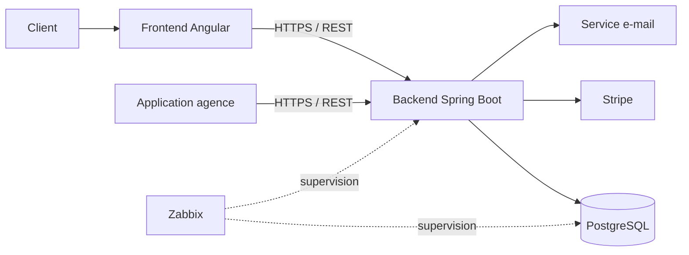
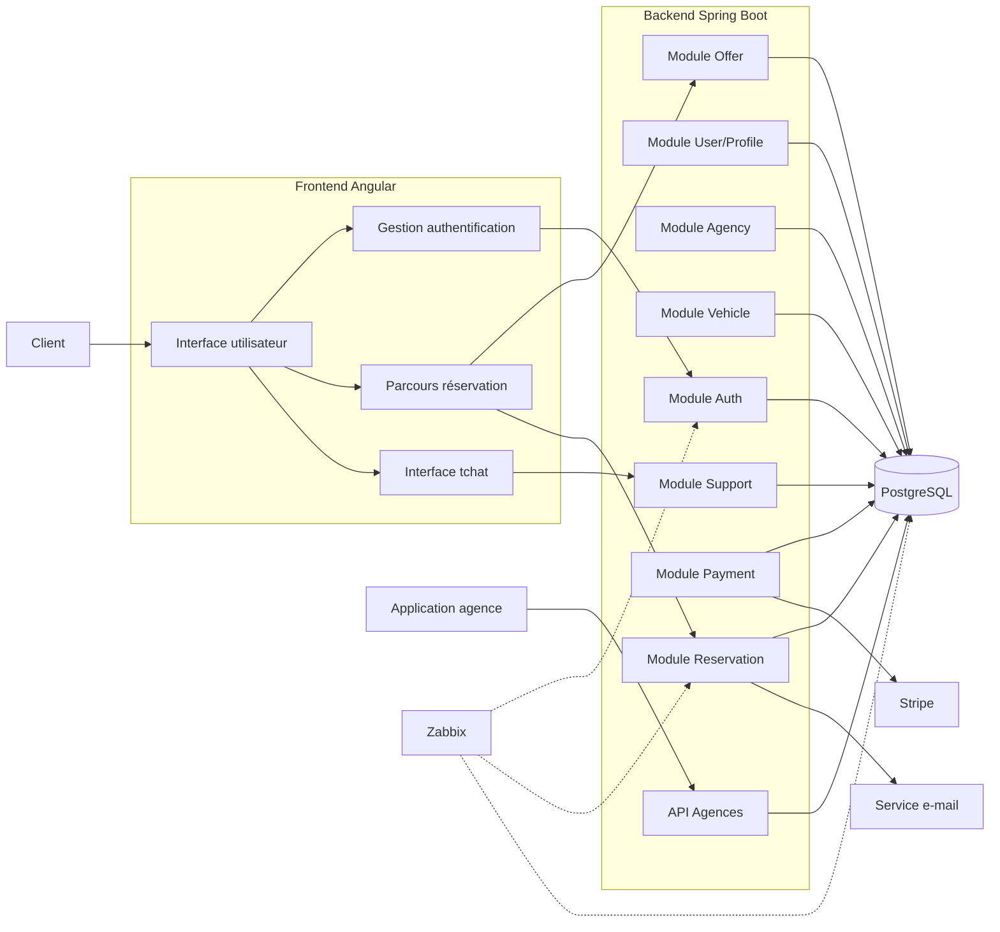
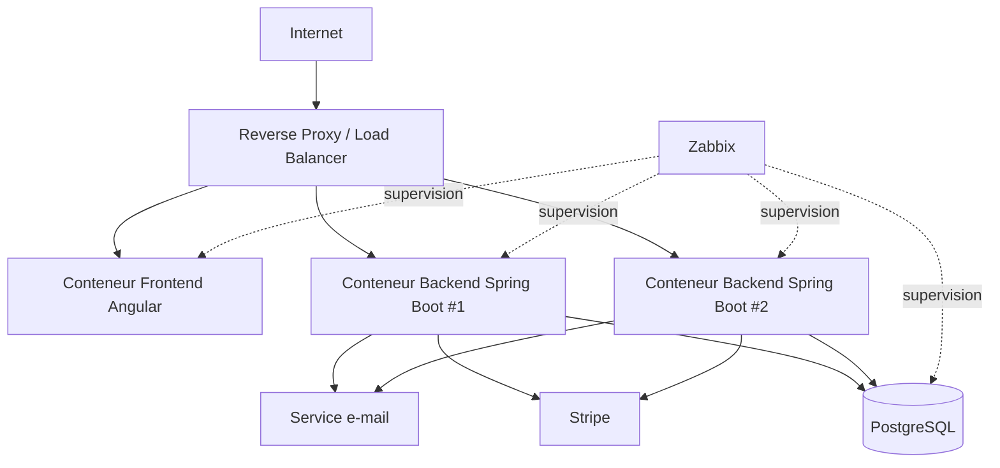
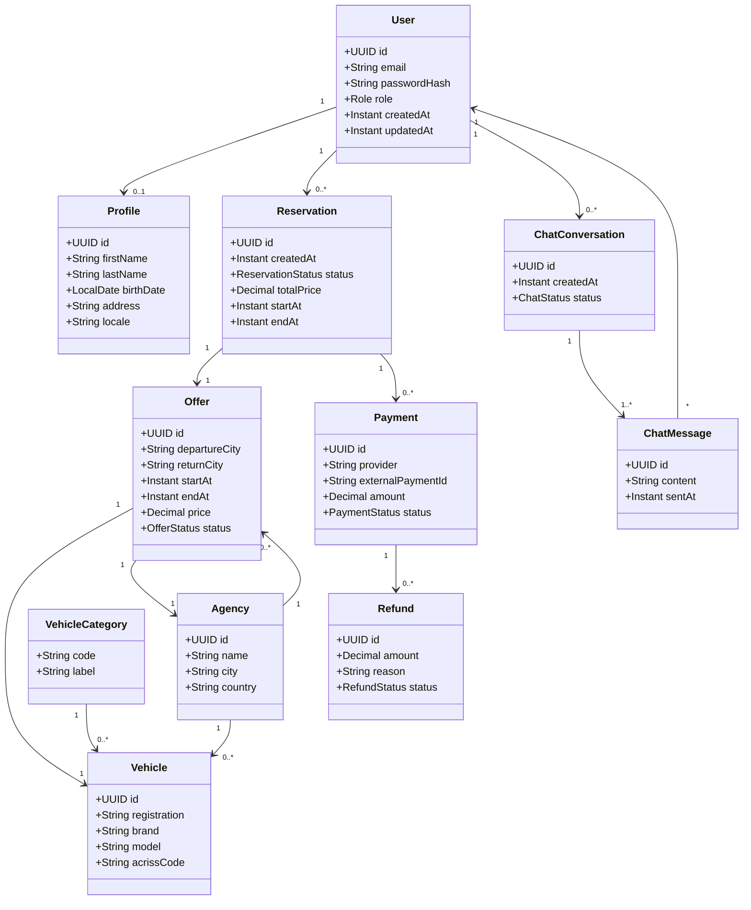
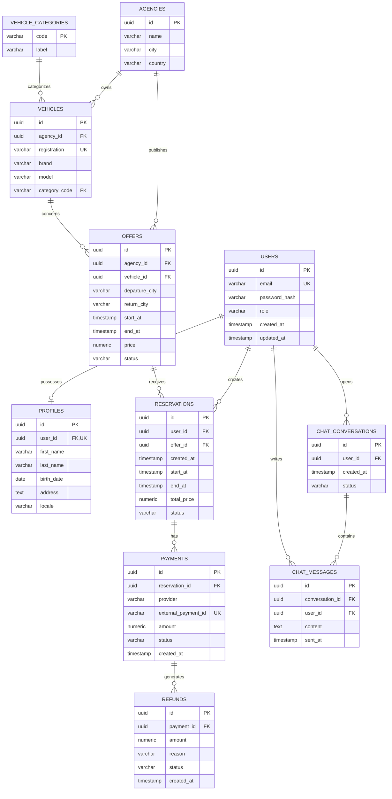
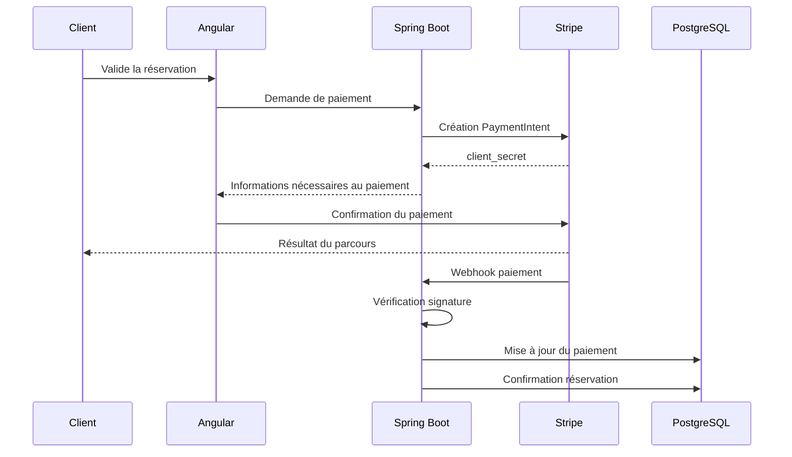

# Dossier d'architecture technique — Your Car Your Way

**Projet :** Refonte de l'application web Your Car Your Way (YCYW)
**Document :** Proposition d'architecture cible
**Version :** 1.0
**Statut :** Proposition pour conception et PoC

---

## Sommaire

1. [Introduction](#1-introduction)
2. [Audit de l'existant](#2-audit-de-lexistant)
3. [Spécifications techniques](#3-spécifications-techniques)
4. [Architecture cible et diagrammes UML](#4-architecture-cible-et-diagrammes-uml)
5. [Modèle de données](#5-modèle-de-données)
6. [Sélection et justification des solutions technologiques](#6-sélection-et-justification-des-solutions-technologiques)
7. [Intégration des composants tiers](#7-intégration-des-composants-tiers)
8. [Bonnes pratiques : sécurité, accessibilité et impact écologique](#8-bonnes-pratiques-sécurité-accessibilité-et-impact-écologique)
9. [Synthèse et trajectoire d'évolution](#9-synthèse-et-trajectoire-dévolution)
10. [Annexes](#10-annexes)

---

# 1. Introduction

## 1.1 Contexte

Your Car Your Way (YCYW) est une entreprise internationale de location de véhicules dont la croissance a conduit à la coexistence de plusieurs applications web développées pour différents marchés.

Cette organisation a progressivement entraîné :

* une hétérogénéité des technologies ;
* des duplications de code ;
* des modèles de données divergents ;
* des règles métier différentes selon les pays ;
* des difficultés de maintenance ;
* des processus de déploiement hétérogènes ;
* des écarts de niveau en matière de sécurité, de disponibilité et de performance.

L'objectif du projet est de concevoir une nouvelle application web centralisée destinée à l'ensemble des clients de YCYW.

La nouvelle solution doit fournir une expérience utilisateur homogène tout en constituant une base technique durable, sécurisée, accessible, performante et évolutive.

## 1.2 Objectif du dossier

Ce dossier formalise la proposition d'architecture cible à partir :

* des besoins fonctionnels et des user stories définis dans le cahier des charges ;
* de l'audit technique de l'existant ;
* des contraintes de sécurité, d'accessibilité, de performance, de disponibilité, d'internationalisation et d'éco-conception.

Il présente :

1. l'audit de l'existant ;
2. les spécifications techniques ;
3. les diagrammes UML et les vues d'architecture ;
4. le modèle de données ;
5. la sélection et la justification des technologies ;
6. l'intégration des composants tiers ;
7. les bonnes pratiques de sécurité, d'accessibilité et d'impact écologique.

L'objectif est de proposer une architecture suffisamment robuste pour répondre aux besoins de YCYW tout en restant proportionnée au cadre du projet de 65 heures.

---

# 2. Audit de l'existant

## 2.1 Objectifs de l'audit

L'audit vise à identifier les caractéristiques de l'architecture actuelle et à évaluer ses limites selon les critères suivants :

* maintenabilité ;
* fiabilité et disponibilité ;
* sécurité ;
* performance ;
* capacité de montée en charge ;
* déploiement ;
* gestion des données.

L'audit constitue un état des lieux. Les solutions présentées dans les sections suivantes correspondent à la conception cible et ne doivent pas être confondues avec les choix techniques de l'existant.

## 2.2 Organisation actuelle

L'existant est constitué de plusieurs applications nationales ou lignées techniques.

Les marchés étudiés sont :

* France ;
* Allemagne ;
* Espagne ;
* Italie ;
* Royaume-Uni ;
* Canada ;
* États-Unis.

La documentation technique décrit plusieurs familles issues de différentes évolutions du système historique.

### France, Allemagne, Espagne et Italie

Les applications reposent historiquement sur Java EE avec JSP/JSF.

La France constitue l'application historique et les autres applications ont été dérivées ou adaptées à partir de celle-ci.

Cette organisation a entraîné une duplication importante du code et une divergence progressive des règles métier.

### Royaume-Uni

L'application britannique repose sur PHP Laravel et est hébergée sur AWS EC2.

Elle constitue une solution indépendante issue d'un produit acquis par YCYW.

### Canada

L'application canadienne utilise :

* React côté frontend ;
* Node.js côté backend ;
* AWS pour l'hébergement.

Elle propose une UX plus moderne mais conserve un backend monolithique.

### États-Unis

L'application américaine utilise :

* Angular côté frontend ;
* Spring Boot côté backend ;
* Azure App Services / Containers.

Il s'agit de l'application la plus récente et de la seule déjà conteneurisée dans l'existant.

## 2.3 Architecture globale de l'existant

L'architecture actuelle est majoritairement monolithique.

Ses principales caractéristiques sont :

* plusieurs applications indépendantes ;
* plusieurs stacks technologiques ;
* une base de données par pays ;
* des schémas de données divergents ;
* des API limitées et hétérogènes ;
* peu de partage automatisé entre applications.

Cette organisation rend difficile la mise en œuvre d'une fonctionnalité commune à l'ensemble des marchés.

## 2.4 Maintenabilité

### Hétérogénéité technologique

| Marché      | Frontend | Backend     | Hébergement |
| ----------- | -------- | ----------- | ----------- |
| France      | JSP/JSF  | Java EE     | OVH         |
| Allemagne   | JSP/JSF  | Java EE     | OVH         |
| Espagne     | JSP/JSF  | Java EE     | OVH         |
| Italie      | JSP/JSF  | Java EE     | OVH         |
| Royaume-Uni | Laravel  | PHP         | AWS EC2     |
| Canada      | React    | Node.js     | AWS         |
| États-Unis  | Angular  | Spring Boot | Azure       |

Cette diversité augmente les compétences nécessaires à la maintenance et multiplie les chaînes de déploiement.

### Duplication du code

Les applications historiques ont été copiées puis adaptées aux spécificités locales.

Cette duplication augmente le risque de divergence et rend les corrections transverses plus coûteuses.

### Fragmentation des données

Chaque pays possède sa propre base de données avec un schéma pouvant différer des autres.

Il n'existe donc pas de modèle de données centralisé.

### Déploiements

Les applications historiques françaises, allemandes, espagnoles et italiennes utilisent des déploiements manuels.

Le taux de réussite des déploiements est indiqué à environ 82 % pour cette famille, contre environ 91 % pour les applications Royaume-Uni, Canada et États-Unis.

## 2.5 Fiabilité et disponibilité

Les disponibilités moyennes sur les 12 derniers mois sont :

| Marché      | Disponibilité |
| ----------- | ------------: |
| France      |        97,2 % |
| Allemagne   |        97,2 % |
| Espagne     |        97,2 % |
| Italie      |        97,2 % |
| Royaume-Uni |        98,6 % |
| Canada      |        98,1 % |
| États-Unis  |        98,9 % |

L'écart montre que les applications les plus récentes ou modernisées présentent globalement une meilleure disponibilité.

Le MTTR est d'environ :

* 2 h 45 pour l'infrastructure OVH ;
* 1 h 10 pour les environnements AWS/Azure.

Après une mise à jour, la stabilisation est d'environ :

* 3,4 jours pour France/Allemagne/Espagne/Italie ;
* 1,7 jour pour Royaume-Uni/Canada/États-Unis.

## 2.6 Sécurité

L'audit révèle une forte hétérogénéité des pratiques.

### Hachage des mots de passe

| Marché      | Mécanisme        |
| ----------- | ---------------- |
| France      | SHA-1            |
| Allemagne   | SHA-1            |
| Espagne     | SHA-1            |
| Italie      | SHA-1            |
| Royaume-Uni | bcrypt, coût 10  |
| Canada      | Argon2id         |
| États-Unis  | bcrypt, force 12 |

Les applications historiques utilisant SHA-1 présentent donc un niveau de protection insuffisant pour une nouvelle application.

### Chiffrement des communications

HTTPS est utilisé sur l'ensemble des applications, mais TLS 1.0 est encore présent en France et en Italie.

### Gestion des secrets

Les pratiques sont également hétérogènes :

* fichiers de configuration sur les environnements historiques OVH ;
* variables d'environnement sur AWS ;
* rotation non automatisée des secrets AWS ;
* utilisation partielle d'Azure Key Vault aux États-Unis.

### Dépendances vulnérables

| Marché      | Dépendances vulnérables |
| ----------- | ----------------------: |
| France      |                    41 % |
| Allemagne   |                 35–40 % |
| Espagne     |                 35–40 % |
| Italie      |                 35–40 % |
| Royaume-Uni |                    18 % |
| Canada      |                    22 % |
| États-Unis  |                    11 % |

## 2.7 Disponibilité et résilience

Les temps d'indisponibilité mensuels sont :

| Marché      | Indisponibilité mensuelle |
| ----------- | ------------------------: |
| France      |                 21–28 min |
| Allemagne   |                 21–28 min |
| Espagne     |                 21–28 min |
| Italie      |                 21–28 min |
| Royaume-Uni |                  9–16 min |
| Canada      |                  9–16 min |
| États-Unis  |                     7 min |

La redondance applicative est inexistante pour les applications historiques et seulement partielle pour le Royaume-Uni et le Canada.

Aux États-Unis, l'application est conteneurisée mais la base de données n'est pas redondante.

Les sauvegardes sont également hétérogènes :

* sauvegardes quotidiennes manuelles et restaurations non testées pour les applications historiques ;
* snapshots AWS quotidiens au Royaume-Uni et au Canada sans tests réguliers de restauration ;
* sauvegarde Azure automatisée aux États-Unis avec test de restauration tous les 90 jours.

## 2.8 Performance

La charge maximale avant dégradation est estimée à :

| Marché      | Charge maximale |
| ----------- | --------------: |
| France      |      ~150 req/s |
| Allemagne   |      ~150 req/s |
| Espagne     |      ~150 req/s |
| Italie      |      ~150 req/s |
| Royaume-Uni |      ~250 req/s |
| Canada      |      ~300 req/s |
| États-Unis  |      ~350 req/s |

Lors des pics saisonniers, le taux d'erreur peut atteindre jusqu'à 4 % pour les applications historiques.

Les applications Royaume-Uni et Canada sont autour de 1,5 %, tandis que les États-Unis sont autour de 0,8 %.

## 2.9 Synthèse de l'audit

| Critère        | Évaluation                  | Principales observations                            |
| -------------- | --------------------------- | --------------------------------------------------- |
| Maintenabilité | Insuffisante                | Hétérogénéité et duplication                        |
| Données        | Insuffisante                | Bases et schémas divergents                         |
| Sécurité       | Hétérogène / insuffisante   | SHA-1, TLS ancien, secrets dispersés                |
| Disponibilité  | Insuffisante                | Pas de redondance historique                        |
| Performance    | Partiellement satisfaisante | Forte différence selon les applications             |
| Scalabilité    | Insuffisante                | Limites de charge et architectures locales          |
| Déploiement    | Hétérogène                  | Déploiements manuels historiques                    |
| Résilience     | Insuffisante                | Sauvegardes et restaurations inégalement maîtrisées |

## 2.10 Conclusion de l'audit

L'audit met principalement en évidence un problème de fragmentation.

Le principal enjeu de la refonte n'est donc pas simplement de remplacer les technologies anciennes, mais de créer un socle commun permettant de :

* centraliser les fonctionnalités ;
* unifier le modèle de données ;
* réduire la duplication ;
* homogénéiser la sécurité ;
* améliorer la disponibilité ;
* faciliter les déploiements ;
* préparer la montée en charge.

---

# 3. Spécifications techniques

## 3.1 Principes architecturaux

La solution cible repose sur les principes suivants :

* application web centralisée ;
* frontend séparé du backend ;
* API REST ;
* backend organisé en modules fonctionnels ;
* base de données relationnelle centralisée ;
* intégrations tierces isolées ;
* conteneurisation ;
* supervision ;
* sécurité par conception ;
* accessibilité dès la conception ;
* architecture évolutive mais volontairement simple.

## 3.2 Architecture retenue

Le choix retenu est un **monolithe modulaire**.

Le backend reste une application Spring Boot unique, mais ses responsabilités sont séparées en modules :

* authentification ;
* utilisateurs/profils ;
* agences ;
* véhicules ;
* offres ;
* réservations ;
* paiements ;
* support ;
* API agences.

Cette approche permet d'obtenir une séparation claire des responsabilités sans introduire la complexité opérationnelle des microservices.

## 3.3 Spécifications backend

Le backend doit :

* exposer les fonctionnalités métier sous forme d'API REST ;
* appliquer les règles métier ;
* authentifier les utilisateurs ;
* gérer les autorisations ;
* gérer les réservations ;
* communiquer avec Stripe ;
* recevoir les webhooks de paiement ;
* communiquer avec le service d'e-mail ;
* fournir l'API aux agences ;
* fournir le tchat temps réel ;
* produire les informations nécessaires à la supervision.

Organisation logique :

```text
Controller
    ↓
Service métier
    ↓
Repository
    ↓
PostgreSQL
```

Les contrôleurs ne doivent pas contenir les règles métier.

## 3.4 Spécifications frontend

Le frontend Angular doit gérer :

* navigation ;
* authentification ;
* compte et profil ;
* recherche ;
* filtrage ;
* consultation des offres ;
* réservation ;
* paiement ;
* historique ;
* modification et annulation ;
* tchat ;
* internationalisation ;
* accessibilité.

Organisation :

```text
frontend/
├── core/
├── shared/
└── features/
    ├── account/
    ├── profile/
    ├── agencies/
    ├── search/
    ├── offers/
    ├── booking/
    ├── reservations/
    ├── payment/
    └── support/
```

## 3.5 API REST

Les principaux domaines d'API sont :

```text
/api/auth
/api/users
/api/agencies
/api/vehicles
/api/offers
/api/reservations
/api/payments
/api/support
```

Exemples :

```text
GET    /api/agencies
GET    /api/offers
GET    /api/offers/{id}

POST   /api/reservations
GET    /api/reservations
GET    /api/reservations/{id}
PUT    /api/reservations/{id}
DELETE /api/reservations/{id}

POST   /api/payments
POST   /api/payments/webhook
```

Les applications des agences utilisent également les endpoints CRUD nécessaires à leur périmètre.

Aucune application cliente n'accède directement à la base de données.

## 3.6 Exigences de performance

Les objectifs techniques sont :

* p95 inférieur à 500 ms sur les parcours critiques ;
* capacité cible d'au moins 500 requêtes/seconde ;
* taux d'erreur inférieur à 0,5 % pendant les pics ;
* pagination serveur pour les listes volumineuses ;
* indexation des colonnes utilisées pour les recherches ;
* optimisation des requêtes SQL ;
* cache lorsque nécessaire ;
* lazy loading côté frontend.

## 3.7 Exigences de disponibilité

La disponibilité cible est de **99,5 %**.

Le backend doit pouvoir être exécuté sur plusieurs instances derrière un reverse proxy ou load balancer.

Le backend doit donc être conçu autant que possible comme **stateless**.

Les données nécessaires au fonctionnement d'une session ne doivent pas dépendre exclusivement de la mémoire d'une instance.

## 3.8 Internationalisation

L'application doit prendre en charge :

* français ;
* anglais ;
* allemand ;
* espagnol ;
* italien.

Elle doit gérer :

* langues ;
* dates ;
* heures ;
* fuseaux horaires ;
* formats numériques ;
* devises ;
* messages localisés.

## 3.9 Contraintes fonctionnelles traduites en exigences techniques

| Besoin               | Exigence technique                      |
| -------------------- | --------------------------------------- |
| Compte               | API d'authentification sécurisée        |
| Profil               | Persistance relationnelle               |
| Recherche            | API filtrable + index PostgreSQL        |
| ACRISS               | Modèle de catégories normalisé          |
| Réservation          | Transactions et contraintes d'intégrité |
| Paiement             | Stripe PaymentIntent + webhook          |
| Modification         | Vérification de la règle des 48 h       |
| Annulation           | Calcul et traçabilité du remboursement  |
| API agences          | API REST authentifiée                   |
| Tchat                | WebSocket/STOMP                         |
| Accessibilité        | UI conforme aux exigences WCAG/RGAA     |
| Internationalisation | Gestion des locales                     |
| Scalabilité          | Instances backend multiples             |
| Supervision          | Zabbix                                  |

---

# 4. Architecture cible et diagrammes UML

## 4.1 Vue globale



Cette vue présente les principaux composants et leurs échanges.

## 4.2 Diagramme UML de composants



## 4.3 Diagramme UML de déploiement



Cette architecture permet d'ajouter une instance backend lorsque la charge augmente.

La base de données est volontairement centralisée dans cette première architecture afin de limiter la complexité.

## 4.4 Diagramme UML de classes métier



## 4.5 Principes de circulation des données

Les clients et applications agences communiquent avec le backend via HTTPS.

Le backend constitue la seule couche autorisée à accéder à PostgreSQL.

Les composants externes tels que Stripe et le service d'e-mail sont également appelés par le backend.

Cette organisation permet de centraliser :

* les règles métier ;
* la sécurité ;
* la validation ;
* la journalisation ;
* la gestion des erreurs.

---

# 5. Modèle de données

## 5.1 Principes

Le modèle de données est centralisé dans PostgreSQL.

Il doit :

* garantir l'intégrité référentielle ;
* éviter les duplications inutiles ;
* permettre l'évolution fonctionnelle ;
* supporter les recherches fréquentes ;
* permettre la traçabilité des opérations sensibles.

## 5.2 Principales entités

Les principales entités sont :

* `User` ;
* `Profile` ;
* `Agency` ;
* `Vehicle` ;
* `VehicleCategory` ;
* `Offer` ;
* `Reservation` ;
* `Payment` ;
* `Refund` ;
* `ChatConversation` ;
* `ChatMessage`.

## 5.3 Modèle relationnel



## 5.4 Contraintes principales

### Utilisateur

* `email` est unique ;
* le mot de passe est stocké uniquement sous forme de hash ;
* le rôle est contrôlé.

### Profil

Un utilisateur possède au maximum un profil.

### Véhicule

L'immatriculation doit être unique.

### Offre

Une offre est associée à une agence et à un véhicule.

Les dates doivent respecter :

```text
start_at < end_at
```

### Réservation

Une réservation appartient à un utilisateur et concerne une offre.

Les changements d'état sont contrôlés par les règles métier.

### Paiement

L'identifiant externe fourni par le prestataire de paiement doit être unique afin d'éviter le traitement d'une même transaction plusieurs fois.

## 5.5 Indexation

Des index seront prévus sur les colonnes utilisées régulièrement dans les recherches :

* `users.email` ;
* `reservations.user_id` ;
* `reservations.status` ;
* `reservations.start_at` ;
* `offers.departure_city` ;
* `offers.return_city` ;
* `offers.start_at` ;
* `offers.end_at` ;
* `offers.status` ;
* `vehicles.category_code`.

La stratégie d'indexation sera validée à partir des requêtes réellement utilisées.

## 5.6 Pagination

Les listes potentiellement volumineuses utilisent une pagination côté serveur.

Exemples :

* résultats de recherche ;
* historique des réservations ;
* offres ;
* véhicules ;
* messages du tchat.

L'objectif est de limiter :

* la quantité de données transférées ;
* la consommation mémoire ;
* le temps de traitement ;
* l'impact réseau.

---

# 6. Sélection et justification des solutions technologiques

## 6.1 Synthèse

| Domaine          | Solution retenue    | Justification                                  |
| ---------------- | ------------------- | ---------------------------------------------- |
| Frontend         | Angular             | Architecture modulaire, composants, TypeScript |
| Backend          | Java / Spring Boot  | Maturité, REST, sécurité, tests                |
| Base de données  | PostgreSQL          | Relationnel, transactions, intégrité           |
| Conteneurisation | Docker              | Reproductibilité des environnements            |
| Paiement         | Stripe              | Externalisation du paiement                    |
| Temps réel       | WebSocket / STOMP   | Adapté au tchat                                |
| Supervision      | Zabbix              | Supervision centralisée                        |
| Architecture     | Monolithe modulaire | Bon compromis simplicité/évolutivité           |

## 6.2 Frontend : Angular

Angular est retenu pour l'interface client.

Les critères de sélection sont :

* architecture à composants ;
* TypeScript ;
* routage ;
* formulaires ;
* injection de dépendances ;
* internationalisation ;
* organisation par fonctionnalités ;
* intégration avec une API REST ;
* facilité de maintenance.

Le choix permet également de capitaliser sur l'application américaine existante qui utilise déjà Angular.

## 6.3 Backend : Java / Spring Boot

Spring Boot est retenu pour le backend.

Les principaux arguments sont :

* maturité de l'écosystème Java ;
* support des API REST ;
* intégration avec PostgreSQL ;
* intégration avec Spring Security ;
* facilité de test ;
* compatibilité avec Docker ;
* possibilité d'exécuter plusieurs instances ;
* cohérence avec l'application américaine existante.

Le choix permet de disposer d'un socle Java moderne tout en abandonnant les technologies Java EE historiques.

## 6.4 Base de données : PostgreSQL

PostgreSQL est retenu car le domaine comporte de nombreuses relations entre :

* utilisateurs ;
* réservations ;
* offres ;
* véhicules ;
* agences ;
* paiements.

Une base relationnelle permet d'assurer les contraintes d'intégrité et les transactions nécessaires aux opérations métier sensibles.

## 6.5 Docker

Docker permet de standardiser les environnements :

* développement ;
* test ;
* recette ;
* production.

Il facilite également la reproduction de l'environnement nécessaire au PoC.

La conteneurisation ne doit cependant pas conduire à multiplier inutilement les services.

## 6.6 Zabbix

Zabbix est retenu pour centraliser la supervision.

Les indicateurs pourront notamment couvrir :

* disponibilité HTTP ;
* état des services ;
* CPU ;
* mémoire ;
* stockage ;
* état des conteneurs ;
* indicateurs applicatifs ;
* alertes.

Le choix de Zabbix remplace le choix initial d'OpenTelemetry envisagé dans une première version de l'architecture.

## 6.7 Stripe

Stripe est retenu comme fournisseur de paiement.

L'intégration permet d'externaliser la gestion des données bancaires et de gérer le parcours de paiement via les mécanismes fournis par le prestataire.

Le suivi côté serveur repose sur les événements de paiement transmis par webhook.

## 6.8 Monolithe modulaire ou microservices

Deux architectures ont été comparées.

| Critère                  | Monolithe modulaire | Microservices |
| ------------------------ | ------------------: | ------------: |
| Simplicité               |                  ++ |             - |
| Coût initial             |                  ++ |             - |
| Facilité de déploiement  |                  ++ |             - |
| Maintenabilité           |                  ++ |            ++ |
| Scalabilité indépendante |                   + |            ++ |
| Complexité réseau        |                  ++ |            -- |
| Adaptation aux 65 h      |                  ++ |            -- |
| Évolution future         |                  ++ |            ++ |

### Décision

Le **monolithe modulaire** est retenu.

L'existant montre que la fragmentation et la duplication sont déjà des problèmes majeurs. Introduire immédiatement des microservices risquerait d'ajouter une nouvelle complexité sans répondre directement au besoin.

Une extraction future de certains modules reste possible si les besoins de scalabilité ou d'organisation le justifient.

## 6.9 PostgreSQL ou NoSQL

| Critère                    | PostgreSQL | MongoDB |
| -------------------------- | ---------: | ------: |
| Relations métier           |         ++ |       + |
| Transactions               |         ++ |       + |
| Intégrité référentielle    |         ++ |       - |
| Requêtes structurées       |         ++ |       + |
| Adaptation au domaine YCYW |         ++ |       + |

### Décision

PostgreSQL est retenu car les relations métier sont nombreuses et structurantes.

---

# 7. Intégration des composants tiers

## 7.1 Principe général

Les composants tiers sont intégrés derrière le backend.

Le frontend ne doit pas posséder les secrets permettant d'appeler des services sensibles.

Le backend joue donc le rôle d'intermédiaire et applique les règles métier avant toute communication externe.

## 7.2 Stripe

Stripe est utilisé pour le paiement en ligne.

### Flux



Le webhook constitue la source de confirmation côté serveur.

L'application ne doit pas considérer uniquement le retour du navigateur comme preuve définitive du paiement.

## 7.3 Gestion des remboursements

Lorsqu'une réservation est annulée, le backend :

1. vérifie les conditions d'annulation ;
2. calcule le montant remboursable ;
3. enregistre la décision métier ;
4. demande le remboursement au fournisseur de paiement ;
5. conserve le statut du remboursement ;
6. met à jour la réservation.

Le montant et les règles précises devront être confirmés avant implémentation.

## 7.4 Service e-mail

Un service d'envoi d'e-mails est utilisé pour :

* confirmation de réservation ;
* notification de modification ;
* notification d'annulation ;
* éventuellement récupération de compte.

Le backend déclenche l'envoi après validation de l'opération métier.

## 7.5 API des agences

Les applications des agences doivent pouvoir accéder aux données nécessaires via une API REST.

Les domaines prévus sont :

```text
Users
Reservations
Vehicles / Offers
Agencies
```

L'accès est protégé par une authentification dédiée.

Les applications agences n'ont pas d'accès direct à PostgreSQL.

Le backend contrôle :

* identité du client API ;
* droits d'accès ;
* validation des données ;
* opérations autorisées ;
* journalisation des opérations sensibles.

## 7.6 Tchat

Le tchat repose sur :

* WebSocket ;
* STOMP ;
* authentification ;
* autorisation ;
* persistance de l'historique.

Flux simplifié :

```text
Client
   ↓
Angular
   ⇅ WebSocket / STOMP
Spring Boot
   ↓
PostgreSQL
```

Le tchat reste intégré au backend afin de limiter la complexité du PoC et de l'architecture initiale.

## 7.7 Supervision avec Zabbix

Zabbix supervise les composants techniques.

Exemples :

```text
Frontend
    └── disponibilité HTTP

Backend
    ├── disponibilité
    ├── temps de réponse
    ├── erreurs
    └── état de l'application

PostgreSQL
    ├── disponibilité
    ├── ressources
    └── indicateurs de fonctionnement

Infrastructure
    ├── CPU
    ├── mémoire
    ├── stockage
    └── conteneurs
```

Des alertes sont déclenchées lorsqu'un seuil critique est atteint.

---

# 8. Bonnes pratiques : sécurité, accessibilité et impact écologique

## 8.1 Sécurité

### Authentification

Les mots de passe sont protégés avec **Argon2id**.

Les mécanismes d'authentification doivent notamment prévoir :

* politique de mot de passe ;
* limitation des tentatives ;
* récupération sécurisée du compte ;
* expiration des mécanismes temporaires ;
* protection des sessions.

### Autorisation

Les ressources sont protégées par des contrôles d'accès.

Exemple :

```text
Client
 ├── gérer son profil
 ├── consulter ses réservations
 └── modifier/annuler ses réservations

Agence
 └── accéder aux ressources autorisées via l'API agence
```

Un utilisateur ne doit jamais pouvoir accéder aux données d'un autre utilisateur simplement en modifiant un identifiant dans une URL.

### Communications

Toutes les communications externes utilisent HTTPS.

Les protocoles obsolètes tels que TLS 1.0 sont exclus.

### Secrets

Les clés et secrets ne sont pas stockés :

* dans le code ;
* dans Git ;
* dans les fichiers de configuration versionnés.

Ils sont fournis par l'environnement ou un gestionnaire de secrets.

Une rotation régulière est prévue pour les secrets concernés.

### Protection des API

Les entrées utilisateur sont validées.

Les protections doivent couvrir notamment :

* injection SQL ;
* XSS ;
* CSRF selon le mécanisme d'authentification ;
* attaques sur les API ;
* exposition de données ;
* contrôle des permissions.

### Journalisation

Les opérations sensibles sont journalisées :

* authentification ;
* modification de réservation ;
* annulation ;
* remboursement ;
* suppression de compte ;
* opérations d'agence.

Les journaux ne doivent pas contenir :

* mots de passe ;
* données bancaires ;
* clés secrètes ;
* informations personnelles non nécessaires.

### Dépendances

Les dépendances sont régulièrement analysées afin de limiter les vulnérabilités connues.

Les mises à jour de sécurité sont intégrées au cycle de maintenance.

---

## 8.2 Protection des données personnelles

La conception applique le principe de minimisation.

Seules les données nécessaires au service sont stockées.

Les fonctionnalités prévues comprennent :

* accès aux données personnelles ;
* modification ;
* suppression du compte ;
* gestion de la conservation ;
* suppression ou anonymisation lorsque nécessaire.

Les durées de conservation devront être précisées avec les responsables métier et juridiques avant mise en production.

---

## 8.3 Accessibilité

L'accessibilité est une exigence transverse.

La cible est :

* WCAG 2.1 niveau AA ;
* prise en compte du RGAA 4.1 dans le contexte français.

Les interfaces doivent notamment proposer :

* navigation au clavier ;
* focus visible et logique ;
* labels explicites ;
* messages d'erreur compréhensibles ;
* structure HTML sémantique ;
* alternatives textuelles ;
* contraste suffisant ;
* absence de dépendance exclusive à la couleur ;
* compatibilité avec les lecteurs d'écran ;
* formulaires accessibles ;
* parcours de paiement accessible ;
* tchat accessible.

L'accessibilité est vérifiée dès le développement et non uniquement à la fin du projet.

---

## 8.4 Éco-conception

La conception cherche à réduire les ressources consommées par l'application.

### Frontend

* lazy loading ;
* réduction du poids JavaScript ;
* compression des images ;
* formats d'image adaptés ;
* limitation des dépendances ;
* cache des ressources statiques.

### Backend

* requêtes SQL optimisées ;
* pagination ;
* limitation des données retournées ;
* cache lorsque pertinent ;
* réduction des traitements inutiles.

### Réseau

* compression HTTP ;
* limitation des appels API ;
* réduction des données transmises ;
* cache lorsque possible.

### Infrastructure

La possibilité de multiplier les instances backend ne doit pas conduire à surdimensionner systématiquement l'infrastructure.

Le dimensionnement doit suivre la charge réelle.

L'objectif défini dans le cahier des charges est notamment d'atteindre un score Lighthouse d'au moins 85 sur desktop et mobile.

---

# 9. Synthèse et trajectoire d'évolution

## 9.1 Architecture cible synthétique

```text
                         INTERNET
                             │
                             ▼
                  Reverse Proxy / LB
                     ┌───────┴───────┐
                     ▼               ▼
              Angular Frontend   Backend Spring Boot
                                      │
                    ┌─────────────────┼─────────────────┐
                    ▼                 ▼                 ▼
               PostgreSQL          Stripe          Service e-mail

                                      │
                                      ▼
                               WebSocket/STOMP
                                  Tchat

                         Zabbix / Supervision
```

## 9.2 Réponse aux problèmes de l'audit

| Problème identifié            | Réponse de l'architecture cible    |
| ----------------------------- | ---------------------------------- |
| Applications multiples        | Application centralisée            |
| Technologies hétérogènes      | Angular + Spring Boot + PostgreSQL |
| Code dupliqué                 | Modules fonctionnels communs       |
| Bases divergentes             | Modèle PostgreSQL centralisé       |
| Déploiements manuels          | Conteneurisation Docker            |
| Faible redondance             | Plusieurs instances backend        |
| Sécurité hétérogène           | Politique de sécurité commune      |
| Paiement intégré différemment | Intégration Stripe centralisée     |
| APIs hétérogènes              | API REST commune                   |
| Supervision dispersée         | Zabbix                             |
| Difficultés d'évolution       | Monolithe modulaire                |

## 9.3 Pourquoi ne pas retenir les microservices immédiatement ?

L'architecture cible ne cherche pas à reproduire une architecture distribuée complexe.

Les microservices apporteraient une scalabilité indépendante et une séparation forte, mais introduiraient également :

* plusieurs déploiements ;
* davantage de communications réseau ;
* une gestion plus complexe des erreurs ;
* une supervision plus complexe ;
* une gestion distribuée des données ;
* un coût de développement supérieur.

Dans le cadre des 65 heures du projet, ces coûts ne sont pas justifiés.

Le monolithe modulaire constitue donc un compromis adapté.

## 9.4 Évolution possible

L'architecture laisse néanmoins une trajectoire d'évolution.

À moyen terme, certains modules pourraient être isolés si leur volume ou leurs contraintes deviennent spécifiques.

Par exemple :

```text
Monolithe modulaire
        │
        ├── Auth
        ├── Users
        ├── Offers
        ├── Reservations
        ├── Payments
        └── Support
                │
                ▼
      Extraction éventuelle
      de modules spécialisés
```

Une extraction ne serait réalisée qu'en présence d'un besoin réel :

* charge importante ;
* besoin de déploiement indépendant ;
* contraintes techniques particulières ;
* évolution organisationnelle.

## 9.5 Conclusion

L'architecture proposée répond aux principaux enjeux révélés par l'audit tout en restant cohérente avec les besoins fonctionnels.

Elle repose sur :

* un frontend Angular ;
* un backend Spring Boot organisé en modules ;
* PostgreSQL comme base relationnelle centralisée ;
* Docker pour la conteneurisation ;
* Stripe pour le paiement ;
* WebSocket/STOMP pour le tchat ;
* Zabbix pour la supervision.

Le choix d'un monolithe modulaire permet de résoudre les problèmes de fragmentation et de duplication de l'existant sans introduire prématurément la complexité d'une architecture microservices.

L'architecture prépare également les évolutions futures grâce à une séparation claire des responsabilités, une API REST, un modèle de données centralisé et la possibilité de multiplier les instances backend.

Elle intègre dès la conception les exigences de sécurité, d'accessibilité, de protection des données, de performance, de disponibilité, d'internationalisation et d'éco-conception.

---

# 10. Annexes

## Annexe A — Correspondance avec les user stories

| User stories  | Composant / module cible        |
| ------------- | ------------------------------- |
| US-01 à US-04 | Authentification                |
| US-05 à US-06 | User / Profile                  |
| US-07         | Agency                          |
| US-08 à US-11 | Offers / Vehicle                |
| US-12 à US-14 | Reservation                     |
| US-15         | Payment / Stripe                |
| US-16         | Reservation + e-mail            |
| US-17 à US-20 | Reservation + Payment           |
| US-21 à US-25 | API Agences                     |
| US-26         | Support / WebSocket             |
| US-27 à US-28 | Frontend / Accessibilité        |
| US-29         | Frontend / Internationalisation |
| US-30         | Architecture sécurité           |
| US-31         | Performance                     |
| US-32         | Déploiement / Scalabilité       |
| US-33         | Éco-conception                  |

## Annexe B — Périmètre du PoC

Le PoC demandé dans le cadre de la mission porte sur le **tchat**.

Il doit permettre de démontrer les choix architecturaux essentiels :

* environnement de développement ;
* frontend Angular ;
* backend Spring Boot ;
* communication WebSocket/STOMP ;
* authentification du canal ;
* persistance minimale des messages ;
* documentation dans le README ;
* structure de projet compréhensible par un développeur junior.

Le PoC ne constitue pas une implémentation complète de l'application YCYW.

## Annexe C — Points restant à préciser

Avant l'implémentation complète, les points suivants doivent être validés avec les parties prenantes :

* règle exacte de modification lorsqu'une nouvelle offre a un prix différent ;
* modalités exactes des remboursements Stripe ;
* durée de conservation des données ;
* règles d'anonymisation ;
* langues et devises supplémentaires ;
* mécanisme exact d'authentification des applications agences ;
* règles de conservation et d'accès à l'historique du tchat ;
* modalités précises de récupération du mot de passe.
