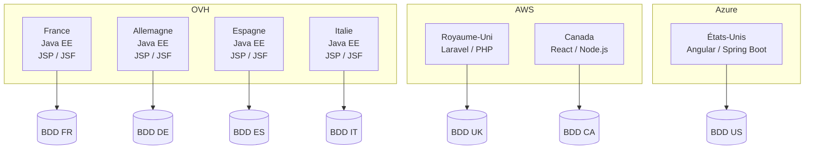
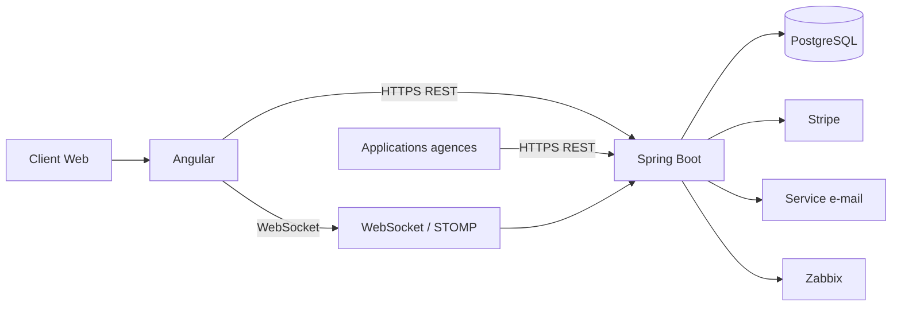
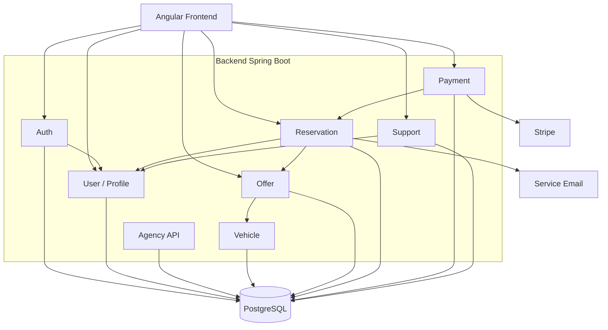
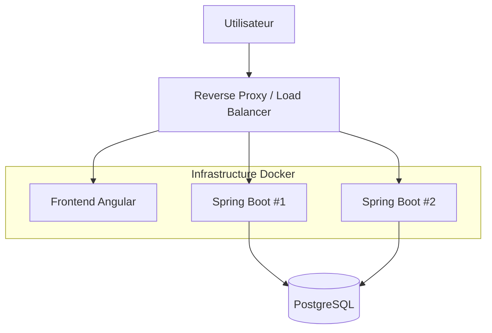
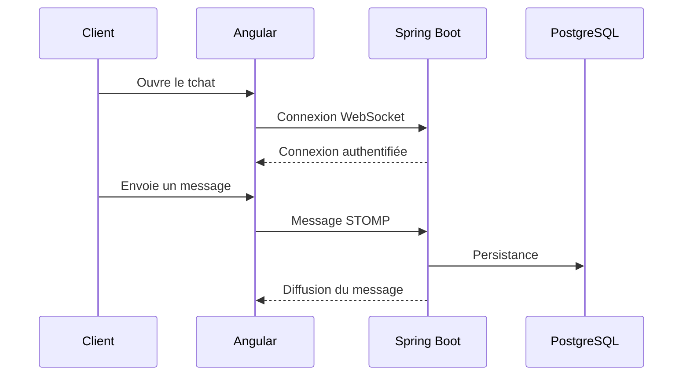
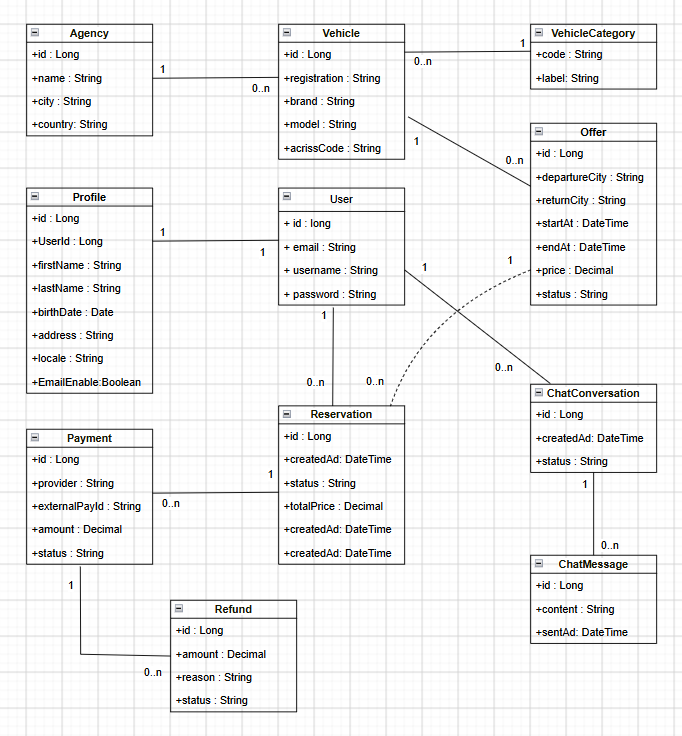
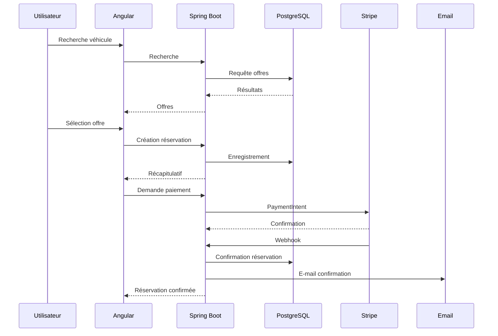

# Dossier d'architecture — Your Car Your Way

**Version : 1.1**
**Projet : Your Car Your Way (YCYW)**
**Type : Architecture cible de l'application web centralisée**

---

# Sommaire

1. [Introduction](#1-introduction)
2. [Audit de l'existant](#2-audit-de-lexistant)
3. [Spécifications techniques](#3-spécifications-techniques)
4. [Architecture cible et diagrammes UML](#4-architecture-cible-et-diagrammes-uml)
5. [Modèle de données](#5-modèle-de-données)
6. [Sélection et justification des solutions technologiques](#6-sélection-et-justification-des-solutions-technologiques)
7. [Intégration des composants tiers](#7-intégration-des-composants-tiers)
8. [Bonnes pratiques : sécurité, accessibilité et impact écologique](#8-bonnes-pratiques-sécurité-accessibilité-et-impact-écologique)
9. [Synthèse et trajectoire d'évolution](#9-synthèse-et-trajectoire-dévolution)
10. [Annexes](#10-annexes)

---

# 1. Introduction

## 1.1 Contexte

Your Car Your Way (YCYW) est une entreprise internationale de location de véhicules disposant actuellement de plusieurs applications web développées selon des technologies, architectures et règles métier différentes selon les pays.

Cette situation entraîne notamment :

* une duplication du code ;
* une divergence progressive des fonctionnalités et des règles métier ;
* des coûts de maintenance importants ;
* des niveaux de sécurité hétérogènes ;
* des performances et niveaux de disponibilité différents selon les pays ;
* une expérience utilisateur non homogène ;
* des difficultés à faire évoluer les applications de manière centralisée.

Le projet consiste donc à concevoir une **application web centralisée** permettant d'unifier l'expérience client et les principaux processus métier de YCYW.

---

## 1.2 Objectifs du projet

L'architecture cible doit permettre :

* de centraliser l'application client ;
* d'uniformiser l'expérience utilisateur ;
* de simplifier la maintenance ;
* de sécuriser les données et les échanges ;
* de supporter une augmentation de la charge ;
* d'améliorer la disponibilité ;
* de faciliter les évolutions futures ;
* d'intégrer les services tiers nécessaires ;
* de respecter les exigences d'accessibilité ;
* de prendre en compte l'impact écologique.

---

## 1.3 Orientations architecturales

Compte tenu du périmètre fonctionnel et de la contrainte de réalisation du projet, l'architecture retenue privilégie :

* la simplicité ;
* la modularité ;
* la maintenabilité ;
* la sécurité ;
* la capacité d'évolution ;
* la limitation des composants techniques inutiles.

Le choix porte donc sur une **architecture web centralisée basée sur un monolithe modulaire**, plutôt que sur une architecture microservices.

---

# 2. Audit de l'existant

## 2.1 Vue d'ensemble

L'existant est constitué de plusieurs applications correspondant aux différents marchés de YCYW.

Les technologies utilisées sont hétérogènes :

| Marché / famille             | Frontend | Backend     | Infrastructure |
| ---------------------------- |----------|-------------| -------------- |
| France                       | JSP / JSF | Java EE     | OVH            |
| Allemagne / Espagne / Italie | JSP / JSF | Java EE     | OVH            |
| Royaume-Uni                  |   —       | Laravel/PHP | AWS EC2        |
| Canada                       | React    | Node.js     | AWS            |
| États-Unis                   | Angular  | Spring Boot | Azure          |

L'architecture dominante est monolithique.

Chaque marché dispose également de sa propre base de données et les modèles de données ont progressivement divergé.
---
### Architecture technique actuelle



Cette représentation met en évidence la fragmentation actuelle : chaque marché dispose de sa propre application et de son propre environnement de données.


## 2.2 Maintenabilité

Les principales difficultés sont :

* duplication du code ;
* variantes locales ;
* règles métier différentes ;
* technologies hétérogènes ;
* absence d'architecture commune ;
* déploiements manuels pour certaines applications.

Cette organisation augmente les coûts de maintenance et rend les évolutions globales difficiles.

---

## 2.3 Fiabilité

Les indicateurs disponibles montrent une différence importante entre les applications historiques et les applications plus récentes.

| Applications      | Disponibilité sur 12 mois |    MTTR |
| ----------------- | ------------------------: | ------: |
| FR / DE / ES / IT |                    97,2 % | ~2 h 45 |
| UK                |                    98,6 % | ~1 h 10 |
| Canada            |                    98,1 % | ~1 h 10 |
| USA               |                    98,9 % | ~1 h 10 |

Les applications historiques sont particulièrement pénalisées par les déploiements manuels et les infrastructures moins redondantes.

---

## 2.4 Sécurité

Les niveaux de sécurité sont hétérogènes.

### Gestion des mots de passe

* FR / DE / ES / IT : SHA-1 ;
* UK : bcrypt coût 10 ;
* Canada : Argon2id ;
* USA : bcrypt.

### Communications

HTTPS est utilisé, mais certaines applications historiques utilisent encore des versions anciennes de TLS.

### Gestion des secrets

Les pratiques varient selon les environnements :

* fichiers de configuration ;
* variables d'environnement ;
* Azure Key Vault partiellement utilisé.

### Dépendances

Les applications historiques présentent également davantage de dépendances vulnérables.

---

## 2.5 Disponibilité et résilience

Les principales limites identifiées sont :

* absence de réplication applicative sur certaines applications ;
* bases de données non systématiquement redondantes ;
* sauvegardes manuelles sur les applications historiques ;
* restaurations rarement testées ;
* capacité de montée en charge limitée.

---

## 2.6 Performance

La capacité avant dégradation varie selon les applications :

| Application       | Capacité approximative |
| ----------------- | ---------------------: |
| FR / DE / ES / IT |              150 req/s |
| UK                |              250 req/s |
| Canada            |              300 req/s |
| USA               |              350 req/s |

Lors des pics saisonniers, le taux d'erreur peut atteindre environ 4 % sur les applications historiques.

---

## 2.7 Synthèse de l'audit

| Critère        | Évaluation                  |
| -------------- | --------------------------- |
| Maintenabilité | Insuffisante                |
| Performance    | Partiellement satisfaisante |
| Disponibilité  | Insuffisante                |
| Fiabilité      | Insuffisante                |
| Scalabilité    | Insuffisante                |
| Sécurité       | Hétérogène / insuffisante   |
| Homogénéité    | Insuffisante                |

L'audit confirme la nécessité d'une architecture centralisée et homogène.

---

# 3. Spécifications techniques

## 3.1 Architecture générale

La solution cible repose sur :

* Angular pour le frontend ;
* Java / Spring Boot pour le backend ;
* PostgreSQL pour la base de données ;
* Docker pour la conteneurisation ;
* Stripe pour le paiement ;
* WebSocket / STOMP pour le tchat ;
* Zabbix pour la supervision.

Les communications utilisent principalement HTTPS.

---

## 3.2 API REST

Le backend expose une API REST.

Exemples :

```text
/api/auth
/api/users
/api/agencies
/api/vehicles
/api/offers
/api/reservations
/api/payments
/api/support
```

Exemples d'opérations :

```http
GET    /api/offers
GET    /api/offers/{id}

POST   /api/reservations
GET    /api/reservations/{id}
PUT    /api/reservations/{id}
DELETE /api/reservations/{id}

POST   /api/payments
POST   /api/payments/webhook
```

Le frontend et les applications agences n'accèdent jamais directement à PostgreSQL.

---

## 3.3 Gestion des utilisateurs

Les fonctionnalités couvertes sont :

* création de compte ;
* authentification ;
* déconnexion ;
* récupération du mot de passe ;
* gestion du profil ;
* gestion des préférences ;
* suppression du compte.

Le mot de passe est stocké sous forme de hash Argon2id.

---

## 3.4 Réinitialisation du mot de passe

Le mécanisme de récupération repose sur un jeton temporaire et à usage unique.

### Demande

```http
POST /api/auth/password-reset/request
```

Le backend :

1. génère un jeton aléatoire ;
2. stocke uniquement son empreinte ;
3. définit une durée d'expiration ;
4. transmet un lien par e-mail.

### Confirmation

```http
POST /api/auth/password-reset/confirm
```

Le backend vérifie :

* la validité du jeton ;
* son expiration ;
* son caractère non utilisé.

Le jeton est invalidé après utilisation.

Le système doit éviter de révéler publiquement si une adresse e-mail possède un compte.

---

## 3.5 Profil et préférences

Le profil utilisateur comprend notamment :

```text
firstName
lastName
birthDate
address
locale
marketingEmailsEnabled
```

La préférence `marketingEmailsEnabled` permet à l'utilisateur de gérer ses préférences de communication lorsque le consentement est requis.

---

## 3.6 Recherche et offres

La recherche prend en compte :

* lieu de départ ;
* lieu de retour ;
* date et heure de départ ;
* date et heure de retour.

Les offres peuvent être :

* filtrées ;
* triées ;
* consultées en détail.

Les véhicules utilisent une classification ACRISS.

---

## 3.7 Pagination et volumétrie

Les listes importantes utilisent une pagination côté serveur.

Exemple :

```http
GET /api/offers?page=0&size=20
```

Cette approche permet :

* de réduire les données transférées ;
* d'améliorer les performances ;
* de limiter la consommation réseau ;
* de réduire la charge du frontend ;
* de contribuer à l'éco-conception.

---

## 3.8 Réservation

Le parcours est :

```text
Recherche
    ↓
Sélection de l'offre
    ↓
Préremplissage du profil
    ↓
Récapitulatif
    ↓
Paiement
    ↓
Confirmation
```

---

## 3.9 Modification d'une réservation

Une réservation peut être modifiée jusqu'à **48 heures avant le début de la location**.

Le contrôle est effectué côté backend.

```text
Demande de modification
        ↓
Vérification du délai de 48 h
        ↓
Vérification de disponibilité
        ↓
Recalcul du prix
        ↓
Mise à jour
        ↓
Confirmation
```

Le frontend ne peut pas contourner cette règle métier.

Le `ReservationService` est responsable du contrôle.

---

## 3.10 Annulation et remboursement

Les règles prévues sont :

| Délai avant départ | Remboursement |
| ------------------ | ------------: |
| Plus de 7 jours    |         100 % |
| De 7 jours à 48 h  |          25 % |
| Moins de 48 h      |           0 % |

Le traitement est réalisé côté backend.

```text
CancellationService
        ↓
Vérification du délai
        ↓
Calcul du remboursement
        ↓
Annulation
        ↓
Demande de remboursement Stripe
        ↓
Mise à jour du statut
```

---

## 3.11 Internationalisation

Les langues prévues sont :

* français ;
* anglais ;
* allemand ;
* espagnol ;
* italien.

Les dates et heures sont stockées en **UTC**.

Le frontend convertit les informations pour l'affichage dans le fuseau horaire approprié.

Les formats locaux sont également pris en compte :

* dates ;
* heures ;
* nombres ;
* devises.

---

## 3.12 Performance

Les objectifs sont :

* p95 < 500 ms sur les pages critiques ;
* capacité cible ≥ 500 req/s ;
* taux d'erreur < 0,5 % pendant les pics.

Les leviers sont :

* indexation ;
* pagination ;
* optimisation SQL ;
* requêtes ciblées ;
* cache lorsque pertinent ;
* lazy loading ;
* optimisation des ressources frontend.

---

## 3.13 Disponibilité

La cible de disponibilité est :

> **99,5 %**

La solution prévoit :

* plusieurs instances backend ;
* reverse proxy / load balancer ;
* backend stateless ;
* sauvegardes PostgreSQL ;
* tests de restauration ;
* health checks ;
* supervision Zabbix.

---

# 4. Architecture cible et diagrammes UML

## 4.1 Architecture cible

L'architecture cible est un **monolithe modulaire**.

```text
Utilisateur
     ↓
Frontend Angular
     ↓ HTTPS / REST
Backend Spring Boot
     ↓
Modules métier
     ↓
PostgreSQL
```

Les applications agences utilisent également l'API REST du backend.

---

## 4.2 Modules du backend

Le backend est organisé autour des domaines suivants :

* Auth ;
* User / Profile ;
* Agency ;
* Vehicle ;
* Offer ;
* Reservation ;
* Payment ;
* Support ;
* Agency API.

Chaque domaine suit une organisation :

```text
Controller
    ↓
Service
    ↓
Repository
    ↓
PostgreSQL
```

---

## 4.3 Diagramme d'architecture globale



---

## 4.4 Diagramme de composants



---

## 4.5 Diagramme de déploiement



Cette architecture permet de multiplier les instances backend sans modifier le frontend.

---

## 4.6 Architecture du tchat



---

# 5. Modèle de données

## 5.1 Principales entités

Le modèle comprend :

* User ;
* Profile ;
* Agency ;
* Vehicle ;
* VehicleCategory ;
* Offer ;
* Reservation ;
* Payment ;
* Refund ;
* ChatConversation ;
* ChatMessage.

---

## 5.2 Diagramme de classes  
  
Diagramme faite sous draw.io  
---

## 5.3 Contraintes d'intégrité

PostgreSQL garantit notamment :

* clés primaires ;
* clés étrangères ;
* contraintes d'unicité ;
* `NOT NULL` ;
* contraintes de domaine ;
* transactions.

---

## 5.4 Indexation

Des index sont prévus notamment sur :

```text
User.email
Offer.startAt
Offer.endAt
Offer.departureCity
Offer.returnCity
Reservation.userId
Reservation.status
Payment.externalPaymentId
```

L'objectif est de réduire le temps d'accès aux données fréquemment recherchées.

---

## 5.5 Suppression et anonymisation des données

La suppression d'un compte doit prendre en compte les obligations éventuelles de conservation.

Le système distingue :

```text
Données supprimables
        +
Données devant éventuellement être conservées
```

Les données personnelles qui ne sont plus nécessaires doivent être supprimées ou anonymisées lorsque cela est possible.

Les durées précises de conservation doivent être validées avec les responsables métier et juridiques.

---

# 6. Sélection et justification des solutions technologiques

## 6.1 Angular

Angular est retenu pour :

* son architecture par composants ;
* TypeScript ;
* son système de routing ;
* la gestion des formulaires ;
* l'internationalisation ;
* la structuration d'applications importantes ;
* la cohérence avec l'application américaine existante.

---

## 6.2 Spring Boot

Spring Boot est retenu pour :

* sa maturité ;
* son écosystème Java ;
* le développement d'API REST ;
* son intégration avec PostgreSQL ;
* Spring Security ;
* les outils de test ;
* Docker ;
* le déploiement multi-instance.

Il permet également de capitaliser sur la technologie utilisée aux États-Unis.

---

## 6.3 PostgreSQL

PostgreSQL est adapté au modèle relationnel du projet.

Il permet notamment :

* transactions ;
* contraintes d'intégrité ;
* relations entre entités ;
* indexation ;
* requêtes structurées.

Il est particulièrement adapté aux données critiques des réservations et paiements.

---

## 6.4 Docker

Docker permet :

* des environnements reproductibles ;
* une installation simplifiée ;
* une meilleure isolation ;
* des déploiements homogènes ;
* une évolution vers plusieurs instances.

---

## 6.5 Zabbix

Zabbix est retenu pour centraliser la supervision.

Il permet notamment de suivre :

* disponibilité ;
* CPU ;
* mémoire ;
* stockage ;
* temps de réponse ;
* erreurs HTTP ;
* health checks ;
* alertes.

Il remplace l'approche OpenTelemetry envisagée précédemment dans l'architecture.

---

## 6.6 Stripe

Stripe est retenu pour externaliser la gestion du paiement.

Cela permet notamment de ne pas gérer directement les données bancaires sensibles dans l'application YCYW.

---

## 6.7 WebSocket / STOMP

WebSocket / STOMP est retenu pour le tchat car cette fonctionnalité nécessite une communication temps réel.

---

## 6.8 Monolithe modulaire vs microservices

| Critère              | Monolithe modulaire | Microservices   |
| -------------------- | ------------------- | --------------- |
| Complexité           | Faible              | Élevée          |
| Déploiement          | Simple              | Complexe        |
| Maintenance          | Simple              | Plus complexe   |
| Scalabilité          | Bonne               | Très bonne      |
| Coût initial         | Faible              | Plus élevé      |
| Adaptation au projet | Très bonne          | Surdimensionnée |

Le monolithe modulaire est donc retenu.

Il permet de conserver une séparation claire entre les domaines tout en évitant la complexité inutile d'une architecture distribuée.

---

## 6.9 PostgreSQL vs NoSQL

| Critère      | PostgreSQL    | NoSQL          |
| ------------ | ------------- | -------------- |
| Relations    | Très adapté   | Variable       |
| Transactions | Très adapté   | Variable       |
| Intégrité    | Forte         | Variable       |
| Données YCYW | Très adaptées | Moins adaptées |

PostgreSQL est donc privilégié.

---

# 7. Intégration des composants tiers

## 7.1 Stripe

Le paiement suit le principe :

```text
Frontend
   ↓
Backend
   ↓
Stripe PaymentIntent
   ↓
Paiement
   ↓
Webhook
   ↓
Backend
   ↓
Confirmation réservation
```

Le webhook permet au backend de confirmer le statut réel du paiement.

---

## 7.2 Remboursement Stripe

Lors d'une annulation éligible :

```text
Annulation
    ↓
Calcul du remboursement
    ↓
CancellationService
    ↓
Stripe
    ↓
Confirmation
    ↓
Mise à jour réservation
```

Le montant du remboursement est déterminé par les règles métier YCYW et non par le frontend.

---

## 7.3 Service e-mail

Un service externe est utilisé pour :

* confirmation de réservation ;
* modification ;
* annulation ;
* récupération du mot de passe.

---

## 7.4 API agences

Les applications agences utilisent l'API REST sécurisée.

```text
Application agence
       ↓
HTTPS
       ↓
API YCYW
       ↓
Authentification JWT
       ↓
Autorisation
       ↓
Service métier
       ↓
PostgreSQL
```

Les applications agences n'accèdent jamais directement à la base de données.

---

## 7.5 Authentification API agences

L'accès est sécurisé par JWT.

Les tokens contiennent des droits ou scopes.

Exemples :

```text
agency:read
agency:write
reservation:read
reservation:write
vehicle:read
vehicle:write
```

Le backend vérifie :

1. l'authenticité du token ;
2. son expiration ;
3. les droits associés ;
4. l'accès à la ressource demandée.

Cette séparation permet d'appliquer le principe du moindre privilège.

---

## 7.6 Tchat

Le tchat utilise :

```text
Angular
    ↓
WebSocket / STOMP
    ↓
Spring Boot
    ↓
PostgreSQL
```

La connexion WebSocket est authentifiée.

Les messages peuvent être persistés afin de conserver l'historique des conversations.

---

## 7.7 Supervision Zabbix

Zabbix surveille notamment :

* infrastructure ;
* backend ;
* disponibilité ;
* performances ;
* erreurs ;
* health checks.

Des alertes sont déclenchées lorsqu'un seuil défini est dépassé.

---

# 8. Bonnes pratiques : sécurité, accessibilité et impact écologique

## 8.1 Sécurité

### Authentification

* Argon2id ;
* protection contre le brute force ;
* limitation des tentatives ;
* gestion sécurisée des sessions/tokens.

### Communications

* HTTPS ;
* TLS 1.3 ;
* désactivation des protocoles obsolètes.

### Secrets

Les secrets ne doivent jamais être :

* dans le code ;
* dans Git ;
* dans les fichiers versionnés ;
* dans les logs.

Ils doivent être stockés dans un gestionnaire sécurisé.

Une rotation des secrets doit être prévue.

### Protection OWASP

L'application doit notamment se protéger contre :

* injections SQL ;
* XSS ;
* CSRF lorsque pertinent ;
* contrôle d'accès défaillant ;
* exposition de données sensibles ;
* mauvaises configurations ;
* dépendances vulnérables.

---

## 8.2 Journalisation et supervision

Les événements importants sont journalisés :

* authentification ;
* échec d'authentification ;
* modification d'une réservation ;
* annulation ;
* remboursement ;
* suppression de compte ;
* événements de sécurité.

Les informations suivantes ne doivent jamais apparaître dans les logs :

* mots de passe ;
* données bancaires ;
* tokens ;
* secrets.

Zabbix permet ensuite de centraliser la supervision et les alertes.

---

## 8.3 Protection des données personnelles

Les principes suivants sont appliqués :

* minimisation des données ;
* limitation des finalités ;
* contrôle des accès ;
* droit d'accès ;
* droit à l'effacement lorsque applicable ;
* politique de conservation ;
* anonymisation lorsque nécessaire.

La suppression du compte doit donc tenir compte des éventuelles obligations légales de conservation.

---

## 8.4 Accessibilité

L'application vise :

* WCAG 2.1 niveau AA ;
* RGAA 4.1.

Les interfaces doivent être accessibles :

* au clavier ;
* avec un lecteur d'écran ;
* avec différents niveaux de zoom.

Les formulaires disposent :

* de labels explicites ;
* d'erreurs compréhensibles ;
* d'un ordre de navigation logique ;
* d'une gestion correcte du focus.

Le tchat respecte également ces principes.

---

## 8.5 Internationalisation et accessibilité

L'interface ne doit pas dépendre uniquement :

* de la couleur ;
* de la position ;
* d'un élément graphique.

Les textes doivent être traduisibles et les composants compatibles avec les lecteurs d'écran.

---

## 8.6 Éco-conception

### Frontend

* lazy loading ;
* réduction des bundles ;
* limitation des dépendances ;
* compression ;
* optimisation des images ;
* formats adaptés.

### Backend

* pagination ;
* requêtes SQL optimisées ;
* limitation des données retournées ;
* cache lorsque pertinent ;
* compression HTTP.

### Infrastructure

* dimensionnement adapté ;
* limitation des ressources inutilisées ;
* mutualisation lorsque possible.

Objectif indicatif :

> **Lighthouse ≥ 85 sur desktop et mobile**

---

# 9. Synthèse et trajectoire d'évolution

## 9.1 Synthèse des choix

| Domaine           | Solution               |
| ----------------- | ---------------------- |
| Frontend          | Angular                |
| Backend           | Spring Boot / Java     |
| Architecture      | Monolithe modulaire    |
| API               | REST                   |
| Base de données   | PostgreSQL             |
| Conteneurisation  | Docker                 |
| Paiement          | Stripe                 |
| Tchat             | WebSocket / STOMP      |
| Supervision       | Zabbix                 |
| Authentification  | Spring Security / JWT  |
| Hash mot de passe | Argon2id               |
| Transport         | HTTPS / TLS 1.3        |
| Langues           | FR / EN / DE / ES / IT |
| Accessibilité     | WCAG 2.1 AA / RGAA 4.1 |
| Temps             | UTC                    |
| Scalabilité       | Multi-instance backend |

---

## 9.2 Correspondance avec les 33 User Stories

| ID   | Fonctionnalité                | Architecture                |
| ---- | ----------------------------- | --------------------------- |
| US01 | Création compte               | Angular + Spring Boot       |
| US02 | Authentification              | Spring Security             |
| US03 | Déconnexion                   | Spring Security             |
| US04 | Réinitialisation mot de passe | Token temporaire + e-mail   |
| US05 | Gestion profil                | User / Profile              |
| US06 | Suppression compte            | Suppression / anonymisation |
| US07 | Agences                       | Agency                      |
| US08 | Recherche                     | Offer API                   |
| US09 | Filtrage / tri                | API + pagination            |
| US10 | Détail offre                  | Offer API                   |
| US11 | ACRISS                        | Vehicle                     |
| US12 | Réservation                   | Reservation                 |
| US13 | Préremplissage                | Profile                     |
| US14 | Récapitulatif                 | Angular                     |
| US15 | Paiement                      | Stripe                      |
| US16 | Confirmation                  | Backend + e-mail            |
| US17 | Historique                    | Reservation                 |
| US18 | Modification                  | ReservationService          |
| US19 | Annulation                    | CancellationService         |
| US20 | Remboursement                 | Stripe                      |
| US21 | API utilisateurs              | Agency API                  |
| US22 | API réservations              | Agency API                  |
| US23 | API offres / véhicules        | Agency API                  |
| US24 | API agences                   | Agency API                  |
| US25 | Authentification API          | JWT + scopes                |
| US26 | Tchat                         | WebSocket / STOMP           |
| US27 | Clavier                       | Angular / accessibilité     |
| US28 | Lecteur d'écran               | Angular / RGAA              |
| US29 | Internationalisation          | Angular i18n + UTC          |
| US30 | Sécurité / confidentialité    | Spring Security + RGPD      |
| US31 | Performance                   | Pagination + indexation     |
| US32 | Disponibilité / scalabilité   | Multi-instance              |
| US33 | Éco-conception                | Optimisation ressources     |

L'architecture cible couvre ainsi l'ensemble des 33 User Stories.

---

## 9.3 Trajectoire d'évolution

### V1 — Centralisation

```text
Angular
   ↓
Spring Boot modulaire
   ↓
PostgreSQL
```

### V2 — Montée en charge

```text
Angular
   ↓
Load Balancer
   ↓
Spring Boot x N
   ↓
PostgreSQL
```

### V3 — Optimisation

Ajout éventuel :

* cache ;
* réplication PostgreSQL ;
* traitements asynchrones ;
* optimisation avancée des recherches.

### V4 — Évolution éventuelle

Si les besoins le justifient, certains modules pourront être extraits du monolithe :

```text
Monolithe modulaire
       ↓
Extraction progressive
       ↓
Services indépendants
```

Cette évolution n'est pas nécessaire pour la première version.

---

## 9.4 PoC

Le PoC demandé porte principalement sur le **tchat**.

Il doit démontrer :

* Angular ;
* Spring Boot ;
* WebSocket ;
* STOMP ;
* authentification ;
* échange de messages ;
* persistance minimale ;
* organisation du projet.

Le PoC ne cherche pas à implémenter les 33 User Stories.

Il sert à valider les choix architecturaux retenus.

---

# 10. Annexes

## 10.1 Exemple d'organisation du projet

```text
ycyw/
├── frontend/
│   └── Angular
│
├── backend/
│   └── Spring Boot
│
├── docker/
│   └── configuration
│
├── docs/
│   └── architecture
│
├── docker-compose.yml
└── README.md
```

---

## 10.2 Organisation du backend

```text
backend/
└── src/main/java/
    └── com.ycyw/
        ├── auth/
        ├── user/
        ├── agency/
        ├── vehicle/
        ├── offer/
        ├── reservation/
        ├── payment/
        └── support/
```

---

## 10.3 Flux de réservation



---

## 10.4 Flux de modification

```text
Utilisateur
    ↓
Modification réservation
    ↓
ReservationService
    ↓
Contrôle délai >= 48 h
    ↓
Vérification disponibilité
    ↓
Recalcul du prix
    ↓
Mise à jour PostgreSQL
    ↓
Confirmation utilisateur
```

---

## 10.5 Flux d'annulation

```text
Utilisateur
    ↓
Demande d'annulation
    ↓
CancellationService
    ↓
Calcul du délai
    ↓
Calcul remboursement
    ↓
Annulation réservation
    ↓
Stripe Refund
    ↓
Mise à jour du statut
    ↓
Confirmation
```

---

## 10.6 Flux de réinitialisation du mot de passe

```text
Utilisateur
    ↓
Demande de réinitialisation
    ↓
POST /api/auth/password-reset/request
    ↓
Génération token temporaire
    ↓
E-mail
    ↓
Lien de réinitialisation
    ↓
POST /api/auth/password-reset/confirm
    ↓
Validation token
    ↓
Nouveau mot de passe
```

---

## 10.7 Flux API agences

```text
Application agence
       ↓
HTTPS
       ↓
JWT
       ↓
Spring Security
       ↓
Vérification scopes
       ↓
Agency API
       ↓
Service métier
       ↓
Repository
       ↓
PostgreSQL
```

---

## 10.8 Critères d'acceptation techniques principaux

| Critère              | Cible                  |
| -------------------- | ---------------------- |
| Temps de réponse p95 | < 500 ms               |
| Capacité             | ≥ 500 req/s            |
| Disponibilité        | ≥ 99,5 %               |
| Taux d'erreur en pic | < 0,5 %                |
| Accessibilité        | WCAG 2.1 AA / RGAA 4.1 |
| Lighthouse           | ≥ 85                   |
| Transport            | HTTPS / TLS 1.3        |
| Mots de passe        | Argon2id               |
| Base de données      | PostgreSQL             |
| Conteneurisation     | Docker                 |
| Supervision          | Zabbix                 |

---

## 10.9 Points restant à valider avant implémentation

Les éléments suivants doivent être confirmés avec les parties prenantes :

1. règles exactes en cas de modification entraînant une augmentation ou une diminution du prix ;
2. modalités précises des remboursements Stripe ;
3. durée de validité du token de réinitialisation ;
4. durées légales de conservation et règles d'anonymisation ;
5. langues et devises supplémentaires éventuelles ;
6. scopes exacts accordés aux applications agences ;
7. règles de conservation de l'historique du tchat ;
8. règles de gestion des fuseaux horaires selon les agences.

---

# Conclusion

L'architecture cible proposée permet de répondre aux principaux problèmes identifiés lors de l'audit de l'existant tout en restant proportionnée au périmètre du projet.

Le choix d'un **monolithe modulaire Angular / Spring Boot / PostgreSQL** permet de centraliser les fonctionnalités, d'homogénéiser les règles métier et de simplifier la maintenance.

L'architecture intègre également :

* Stripe pour les paiements ;
* WebSocket / STOMP pour le tchat ;
* Zabbix pour la supervision ;
* JWT pour sécuriser l'API agences ;
* Argon2id pour les mots de passe ;
* HTTPS / TLS 1.3 ;
* les mécanismes de suppression et d'anonymisation des données ;
* la gestion des préférences utilisateur ;
* l'internationalisation et la gestion des fuseaux horaires ;
* les contraintes d'accessibilité ;
* les principes d'éco-conception.

Elle permet également une montée en charge progressive grâce à la possibilité de déployer plusieurs instances backend derrière un load balancer.

Enfin, la séparation des domaines métier permet de faire évoluer ultérieurement certains modules vers des services indépendants si la volumétrie ou les besoins organisationnels le justifient.

Cette architecture V1.1 est cohérente avec le cahier des charges, les **33 User Stories**, les contraintes identifiées lors de l'audit et le périmètre du PoC.
