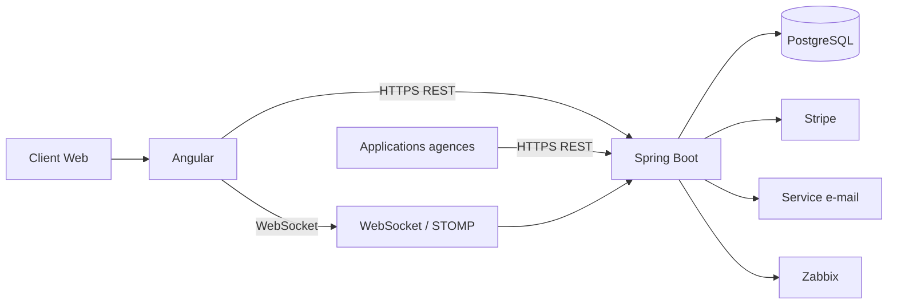
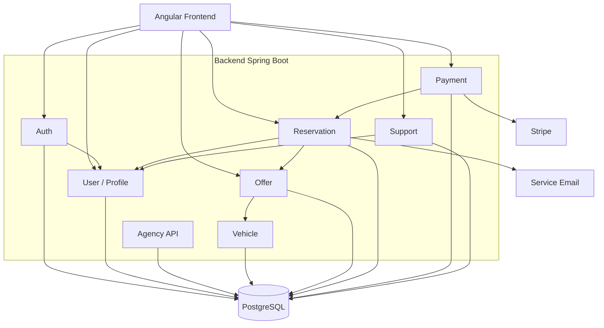
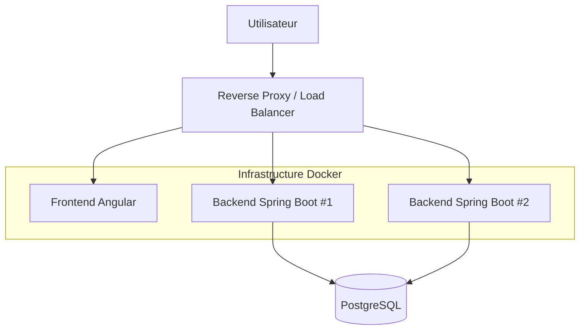
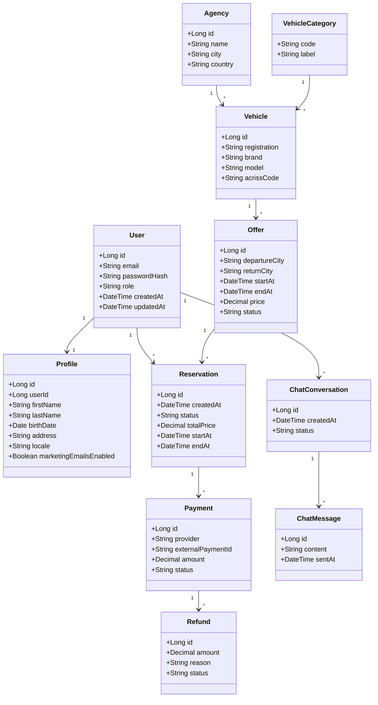
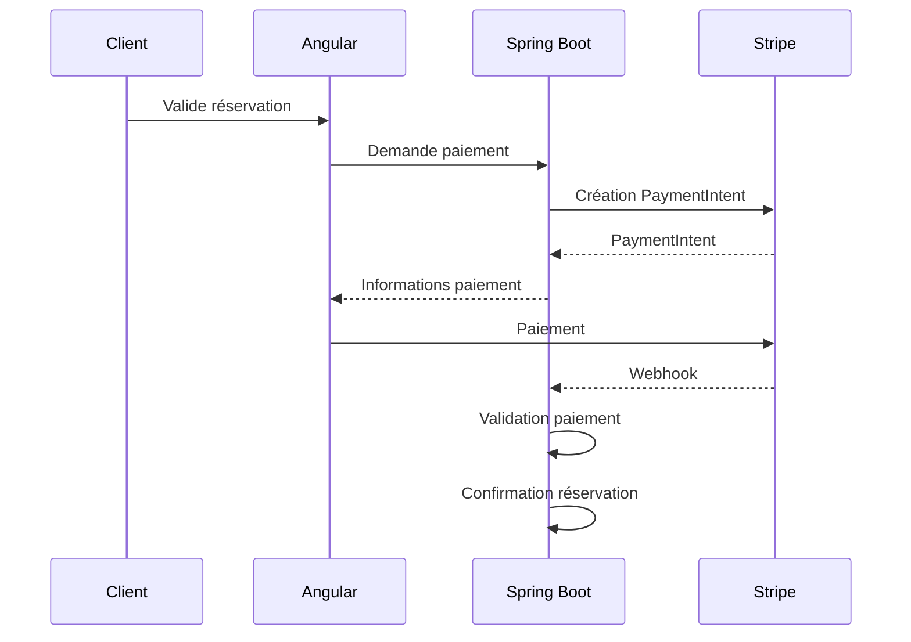

# Dossier d’architecture — Your Car Your Way

**Version : 1.1**
**Projet : Your Car Your Way (YCYW)**
**Type : Proposition d’architecture cible**
**Périmètre : Application web centralisée de location de véhicules**

---

# 1. Introduction

## 1.1 Contexte

Your Car Your Way (YCYW) est une entreprise internationale de location de véhicules disposant actuellement de plusieurs applications web développées selon des technologies, architectures et règles métier différentes selon les pays.

Cette situation entraîne notamment :

* une duplication du code ;
* une divergence progressive des fonctionnalités et des règles métier ;
* des coûts de maintenance importants ;
* des niveaux de sécurité hétérogènes ;
* des performances et niveaux de disponibilité différents selon les pays ;
* une expérience utilisateur non homogène ;
* des difficultés à faire évoluer les applications de manière centralisée.

Le projet consiste donc à concevoir une **application web centralisée** permettant d'unifier l'expérience client et les principaux processus métier de YCYW.

---

## 1.2 Objectifs de l'architecture cible

L'architecture cible doit permettre :

* de centraliser l'application client ;
* d'uniformiser l'expérience utilisateur ;
* de simplifier la maintenance ;
* de sécuriser les données et les échanges ;
* de supporter une augmentation de la charge ;
* d'améliorer la disponibilité ;
* de faciliter les évolutions futures ;
* d'intégrer les services tiers nécessaires ;
* de respecter les exigences d'accessibilité ;
* de prendre en compte l'impact écologique.

Compte tenu de la contrainte de réalisation du projet et du temps disponible, l'architecture retenue privilégie une solution **simple, modulaire et évolutive**, plutôt qu'une architecture distribuée complexe.

---

# 2. Audit de l'existant

## 2.1 Synthèse

L'analyse de l'existant met en évidence plusieurs familles d'applications correspondant aux différents marchés de YCYW.

Les technologies et infrastructures utilisées sont hétérogènes :

| Marché / famille | Frontend  | Backend     | Infrastructure |
| ---------------- | --------- | ----------- | -------------- |
| FR               | JSP / JSF | Java EE     | OVH            |
| DE / ES / IT     | JSP / JSF | Java EE     | OVH            |
| UK               | Laravel   | PHP         | AWS EC2        |
| Canada           | React     | Node.js     | AWS            |
| USA              | Angular   | Spring Boot | Azure          |

L'architecture dominante reste une architecture **monolithique**, avec une base de données propre à chaque marché.

---

## 2.2 Principales faiblesses identifiées

### Maintenabilité

Les applications historiques présentent :

* du code dupliqué ;
* des variantes locales ;
* des règles métier divergentes ;
* des technologies vieillissantes ;
* des déploiements manuels sur certaines plateformes.

La maintenance nécessite donc des interventions spécifiques selon les pays.

### Fiabilité

Les applications historiques présentent des taux de disponibilité différents.

Les applications FR/DE/ES/IT présentent notamment :

* une disponibilité d'environ 97,2 % ;
* un MTTR d'environ 2 h 45 ;
* des déploiements manuels ;
* une stabilisation moyenne de 3,4 jours après une mise à jour.

Les plateformes UK/Canada/USA présentent de meilleurs indicateurs, mais restent elles aussi isolées.

### Sécurité

Les niveaux de sécurité sont hétérogènes.

Exemples :

* SHA-1 encore utilisé sur certaines applications ;
* versions TLS anciennes encore présentes sur certains environnements ;
* gestion des secrets non homogène ;
* dépendances présentant des vulnérabilités ;
* absence de politique centralisée de sécurité.

### Disponibilité et résilience

L'existant présente :

* une réplication applicative limitée ;
* des bases de données ne disposant pas systématiquement de redondance ;
* des sauvegardes dont les restaurations ne sont pas toujours testées ;
* une capacité de montée en charge variable.

### Performance

La capacité maximale avant dégradation varie fortement selon les plateformes :

* environ 150 req/s pour les applications historiques ;
* environ 250 req/s pour le Royaume-Uni ;
* environ 300 req/s pour le Canada ;
* environ 350 req/s pour les États-Unis.

Les pics saisonniers provoquent également des taux d'erreur plus importants sur les plateformes historiques.

---

## 2.3 Conclusion de l'audit

| Critère                   | Évaluation                  |
| ------------------------- | --------------------------- |
| Maintenabilité            | Insuffisante                |
| Performance               | Partiellement satisfaisante |
| Disponibilité             | Insuffisante                |
| Fiabilité                 | Insuffisante                |
| Scalabilité               | Insuffisante                |
| Sécurité                  | Hétérogène et insuffisante  |
| Homogénéité fonctionnelle | Insuffisante                |

L'audit justifie donc la mise en place d'une **architecture centralisée, modulaire et homogène**.

---

# 3. Spécifications techniques

## 3.1 Architecture générale

L'architecture cible repose sur quatre composants principaux :

* une application frontend Angular ;
* une application backend Java Spring Boot ;
* une base de données PostgreSQL ;
* une infrastructure conteneurisée Docker.

Les communications entre les composants sont réalisées via des protocoles standards :

* HTTPS / REST pour les fonctionnalités métier ;
* WebSocket / STOMP pour le tchat ;
* HTTPS / API pour les services tiers.

---

## 3.2 Architecture applicative

L'architecture retenue est un **monolithe modulaire**.

Le backend Spring Boot est organisé par domaines fonctionnels.

### Modules backend

* Authentification
* Utilisateurs / profils
* Agences
* Véhicules
* Offres
* Réservations
* Paiements
* Support / tchat
* API agences

Chaque module possède une séparation claire entre :

```text
Controller
    ↓
Service métier
    ↓
Repository
    ↓
PostgreSQL
```

Cette organisation permet de conserver la simplicité d'un monolithe tout en préparant une éventuelle évolution future vers des composants indépendants.

---

## 3.3 API REST

Le backend expose une API REST consommée par le frontend Angular et par les applications des agences.

Exemples :

```text
/api/auth
/api/users
/api/agencies
/api/vehicles
/api/offers
/api/reservations
/api/payments
/api/support
```

### Exemples de ressources

```http
GET    /api/agencies
GET    /api/offers
GET    /api/offers/{id}

POST   /api/reservations
GET    /api/reservations/{id}
PUT    /api/reservations/{id}
DELETE /api/reservations/{id}

POST   /api/payments
POST   /api/payments/webhook
```

Le frontend ne communique jamais directement avec PostgreSQL.

---

# 4. Gestion du compte et du profil

## 4.1 Création et authentification

Les fonctionnalités suivantes sont prises en charge :

* création d'un compte ;
* authentification ;
* déconnexion ;
* récupération du mot de passe ;
* suppression du compte.

Les mots de passe sont stockés sous forme de hash avec **Argon2id**.

---

## 4.2 Réinitialisation du mot de passe

La récupération du mot de passe est réalisée avec un mécanisme de jeton temporaire.

### Demande de réinitialisation

```http
POST /api/auth/password-reset/request
```

Le backend :

1. vérifie l'existence éventuelle du compte ;
2. génère un jeton aléatoire ;
3. stocke uniquement une empreinte du jeton ;
4. associe une durée de validité ;
5. transmet un lien de réinitialisation par e-mail.

### Confirmation

```http
POST /api/auth/password-reset/confirm
```

Le backend vérifie :

* la validité du jeton ;
* son expiration ;
* son caractère non utilisé.

Le jeton est ensuite invalidé après utilisation.

Le système ne doit pas révéler si une adresse e-mail correspond ou non à un compte existant.

---

# 5. Gestion du profil et des préférences

Le profil utilisateur contient notamment :

```text
firstName
lastName
birthDate
address
locale
marketingEmailsEnabled
```

Le champ `marketingEmailsEnabled` permet de gérer les préférences de communication lorsque le consentement est nécessaire.

La gestion du profil comprend :

* modification des informations personnelles ;
* choix de la langue ;
* gestion des préférences de communication ;
* consultation des informations du compte.

---

# 6. Recherche et catalogue

## 6.1 Recherche

L'utilisateur peut rechercher un véhicule selon :

* lieu de départ ;
* lieu de retour ;
* date et heure de départ ;
* date et heure de retour.

Les résultats sont fournis par l'API backend.

---

## 6.2 Filtrage et tri

Les résultats peuvent être filtrés ou triés selon les critères disponibles, notamment :

* catégorie ;
* prix ;
* caractéristiques du véhicule ;
* disponibilité.

Les traitements lourds sont réalisés côté serveur lorsque cela est nécessaire.

---

## 6.3 Pagination

Les listes volumineuses utilisent une **pagination côté serveur**.

Exemple :

```http
GET /api/offers?page=0&size=20
```

Cette approche permet :

* de réduire le volume de données transféré ;
* d'améliorer les temps de réponse ;
* de réduire la consommation réseau ;
* de limiter la charge sur le frontend ;
* de contribuer à l'éco-conception.

---

# 7. Offres et classification ACRISS

Chaque véhicule est associé à une catégorie et peut disposer d'un code ACRISS.

Exemple :

```text
Vehicle
    ↓
VehicleCategory
    ↓
ACRISS code
```

L'utilisation d'ACRISS permet d'harmoniser la classification des véhicules entre les différents marchés.

---

# 8. Gestion des réservations

## 8.1 Création

Le parcours de réservation est :

```text
Recherche
   ↓
Sélection d'une offre
   ↓
Informations client
   ↓
Récapitulatif
   ↓
Paiement
   ↓
Confirmation
```

Le profil utilisateur peut être réutilisé afin de préremplir les informations nécessaires.

---

## 8.2 Modification d'une réservation

Une réservation peut être modifiée jusqu'à **48 heures avant le début de la location**, conformément au cahier des charges.

La modification est contrôlée côté backend.

Le processus est :

```text
Demande de modification
        ↓
Vérification du délai de 48 h
        ↓
Vérification de disponibilité
        ↓
Recalcul du prix
        ↓
Mise à jour de la réservation
        ↓
Confirmation
```

La règle métier ne repose donc pas uniquement sur le frontend.

Le service `ReservationService` est responsable de la validation de la modification.

---

# 9. Annulation et remboursement

## 9.1 Règles métier

Les règles de remboursement sont :

| Moment de l'annulation                | Remboursement |
| ------------------------------------- | ------------: |
| Plus de 7 jours avant le départ       |         100 % |
| Entre 7 jours et 48 h avant le départ |          25 % |
| Moins de 48 h avant le départ         |           0 % |

Ces règles sont appliquées par le backend.

---

## 9.2 Service d'annulation

Le traitement peut être structuré ainsi :

```text
CancellationService
    ↓
Vérification du délai
    ↓
Calcul du remboursement
    ↓
Annulation de la réservation
    ↓
Demande de remboursement Stripe
    ↓
Mise à jour du statut
```

Le calcul du remboursement est effectué par le backend afin de garantir une application homogène des règles métier.

---

# 10. Paiement

## 10.1 Stripe

Le paiement est externalisé vers **Stripe**.

L'application utilise notamment le mécanisme `PaymentIntent`.

Le backend crée et contrôle l'opération de paiement.

---

## 10.2 Webhook

Le statut du paiement est synchronisé grâce à un webhook :

```http
POST /api/payments/webhook
```

Le backend vérifie la signature du webhook avant de traiter l'événement.

Le webhook permet notamment de gérer :

* paiement réussi ;
* paiement échoué ;
* paiement nécessitant une action ;
* remboursement.

Le frontend ne détermine jamais seul qu'une réservation est payée.

---

# 11. Confirmation de réservation

Après confirmation du paiement :

```text
Paiement confirmé
       ↓
Réservation confirmée
       ↓
E-mail de confirmation
```

L'e-mail peut contenir :

* numéro de réservation ;
* informations du véhicule ;
* agence de départ ;
* dates ;
* montant ;
* statut de la réservation.

Le service d'e-mail est considéré comme un composant externe à l'application.

---

# 12. API destinée aux agences

Les agences disposent d'une API REST sécurisée.

Elle permet notamment :

### Utilisateurs

```http
GET    /api/agency/users
POST   /api/agency/users
PUT    /api/agency/users/{id}
DELETE /api/agency/users/{id}
```

### Réservations

```http
GET /api/agency/reservations
GET /api/agency/reservations/{id}
PUT /api/agency/reservations/{id}
```

### Véhicules et offres

```http
GET  /api/agency/vehicles
POST /api/agency/vehicles
PUT  /api/agency/vehicles/{id}

GET  /api/agency/offers
POST /api/agency/offers
PUT  /api/agency/offers/{id}
```

### Agences

```http
GET /api/agency/agencies
PUT /api/agency/agencies/{id}
```

Les applications agences n'accèdent jamais directement à PostgreSQL.

---

# 13. Authentification de l'API agences

L'accès des applications agences est sécurisé par une authentification basée sur **JWT**.

Le principe est :

```text
Application agence
       ↓
Authentification
       ↓
JWT
       ↓
API YCYW
       ↓
Vérification du token
       ↓
Autorisation
       ↓
Service métier
```

Les tokens comportent des droits ou scopes permettant de limiter les opérations accessibles.

Exemples :

```text
agency:read
agency:write
reservation:read
reservation:write
vehicle:read
vehicle:write
```

Cette approche permet de distinguer :

* l'identité du consommateur de l'API ;
* ses droits ;
* les ressources auxquelles il peut accéder.

---

# 14. Tchat avec le support

Le tchat constitue le périmètre principal du PoC.

La communication temps réel repose sur :

* WebSocket ;
* STOMP.

Architecture :

```text
Angular
   │
   │ WebSocket / STOMP
   ▼
Spring Boot
   │
   ▼
Support
   │
   ▼
PostgreSQL
```

Les conversations et messages peuvent être persistés.

L'accès au WebSocket est authentifié afin d'empêcher un utilisateur non autorisé d'accéder aux conversations.

---

# 15. Internationalisation

L'application doit être disponible dans les langues :

* français ;
* anglais ;
* allemand ;
* espagnol ;
* italien.

Les données temporelles sont stockées en **UTC** côté backend et en base de données.

Le frontend effectue l'affichage dans le fuseau horaire approprié.

Exemple :

```text
Base de données
2026-09-02T12:00:00Z
        ↓
Frontend
        ↓
Affichage dans le fuseau local
```

Cette stratégie évite les incohérences entre les différents pays.

Les formats suivants sont également adaptés au contexte local :

* dates ;
* heures ;
* devises ;
* nombres ;
* formats d'affichage.

---

# 16. Architecture UML

## 16.1 Diagramme d'architecture globale



---

## 16.2 Diagramme de composants



---

# 17. Architecture de déploiement



L'utilisation de plusieurs instances backend permet de supporter une montée en charge progressive.

Le backend est conçu pour être autant que possible **stateless**, afin que les requêtes puissent être distribuées entre plusieurs instances.

---

# 18. Modèle de données

## 18.1 Entités principales

Les principales entités sont :

* User ;
* Profile ;
* Agency ;
* Vehicle ;
* VehicleCategory ;
* Offer ;
* Reservation ;
* Payment ;
* Refund ;
* ChatConversation ;
* ChatMessage.

---

## 18.2 Diagramme de classes



---

# 19. Contraintes du modèle de données

La base PostgreSQL doit garantir l'intégrité des données grâce notamment à :

* clés primaires ;
* clés étrangères ;
* contraintes `NOT NULL` ;
* contraintes d'unicité ;
* contraintes de domaine lorsque nécessaire ;
* transactions pour les opérations critiques.

Des index sont prévus sur les colonnes fréquemment utilisées dans les recherches.

Exemples :

```text
User.email
Offer.startAt
Offer.endAt
Offer.departureCity
Offer.returnCity
Reservation.userId
Reservation.status
Payment.externalPaymentId
```

---

# 20. Sélection des solutions technologiques

## 20.1 Frontend : Angular

Angular est retenu pour :

* son architecture basée sur les composants ;
* TypeScript ;
* son système de routing ;
* la gestion des formulaires ;
* ses mécanismes d'internationalisation ;
* ses possibilités de structuration d'une application importante ;
* la cohérence avec l'expérience déjà disponible sur l'application américaine.

Angular permet également de construire une application accessible et maintenable grâce à une organisation structurée des composants.

---

## 20.2 Backend : Spring Boot

Spring Boot est retenu pour :

* sa maturité ;
* son intégration avec Java ;
* sa capacité à développer des API REST ;
* son intégration avec PostgreSQL ;
* Spring Security ;
* les outils de test ;
* son intégration avec Docker ;
* sa capacité à fonctionner avec plusieurs instances.

Le choix permet également de capitaliser sur la technologie déjà utilisée par l'application américaine.

---

## 20.3 Base de données : PostgreSQL

PostgreSQL est adapté au projet car le domaine comporte de nombreuses relations :

```text
Utilisateur
    ↓
Réservation
    ↓
Offre
    ↓
Véhicule
    ↓
Catégorie
```

Les transactions et contraintes d'intégrité sont particulièrement importantes pour les réservations et paiements.

---

## 20.4 Conteneurisation : Docker

Docker permet :

* de reproduire les environnements ;
* de simplifier les déploiements ;
* d'isoler les composants ;
* de faciliter les tests ;
* de préparer la montée en charge.

---

# 21. Monolithe modulaire plutôt que microservices

Une architecture microservices pourrait permettre de séparer les domaines métier.

Cependant, elle entraînerait :

* davantage de composants ;
* davantage de déploiements ;
* une gestion réseau plus complexe ;
* des problématiques supplémentaires de communication ;
* une supervision plus importante ;
* une complexité disproportionnée par rapport au périmètre.

Le projet dispose d'une contrainte de temps de réalisation importante.

Le choix retenu est donc :

> **Un monolithe modulaire Spring Boot pouvant évoluer ultérieurement vers des services indépendants si le besoin apparaît.**

Cette solution permet de conserver une architecture simple tout en maintenant une séparation claire des responsabilités.

---

# 22. Comparaison PostgreSQL / NoSQL

Une base NoSQL pourrait être envisagée pour certaines données.

Cependant, le projet nécessite principalement :

* des relations fortes ;
* des transactions ;
* des contraintes d'intégrité ;
* des recherches structurées ;
* une cohérence forte des réservations et paiements.

PostgreSQL est donc privilégié.

---

# 23. Intégration des composants tiers

## 23.1 Stripe



Le backend reste l'autorité métier sur le statut de la réservation.

---

## 23.2 Service e-mail

Le backend utilise un service d'e-mail externe pour :

* confirmations ;
* modifications ;
* annulations ;
* récupération de mot de passe.

Les informations sensibles inutiles ne doivent pas être incluses dans les e-mails.

---

## 23.3 API agences

Les applications agences communiquent avec l'API YCYW exclusivement via HTTPS.

```text
Agence
   ↓
HTTPS
   ↓
API Gateway / Reverse Proxy
   ↓
Spring Boot
   ↓
Services métier
   ↓
PostgreSQL
```

---

## 23.4 Zabbix

Zabbix est utilisé pour la supervision de l'infrastructure et de l'application.

La supervision porte notamment sur :

* disponibilité ;
* CPU ;
* mémoire ;
* stockage ;
* temps de réponse ;
* erreurs HTTP ;
* disponibilité des composants ;
* indicateurs applicatifs ;
* alertes.

Exemples :

```text
Health check
GET /actuator/health

Métrique
HTTP response time

Alerte
Taux d'erreur HTTP > seuil

Alerte
Instance backend indisponible
```

---

# 24. Sécurité

## 24.1 Authentification

Les mots de passe sont protégés par **Argon2id**.

Les mécanismes d'authentification doivent également prévoir :

* limitation des tentatives ;
* expiration des sessions/tokens selon le mécanisme utilisé ;
* protection contre le brute force ;
* journalisation des événements de sécurité.

---

## 24.2 Communications

Toutes les communications utilisent HTTPS.

La cible est :

```text
TLS 1.3
```

Les protocoles obsolètes doivent être désactivés.

---

## 24.3 Gestion des secrets

Les secrets ne doivent jamais être stockés :

* dans le code ;
* dans Git ;
* dans les fichiers de configuration versionnés ;
* dans les logs.

Ils sont stockés dans un mécanisme sécurisé de gestion des secrets.

La rotation des secrets doit être prévue.

---

## 24.4 Protection OWASP

L'application doit notamment se protéger contre :

* injections SQL ;
* XSS ;
* CSRF lorsque pertinent ;
* contrôle d'accès défaillant ;
* exposition de données sensibles ;
* mauvaise configuration ;
* dépendances vulnérables.

Les données entrantes doivent être validées côté backend.

---

## 24.5 Journalisation

Les événements importants sont journalisés :

* authentification ;
* échec d'authentification ;
* modification d'une réservation ;
* annulation ;
* remboursement ;
* suppression d'un compte ;
* événements de sécurité.

Les logs ne doivent pas contenir :

* mots de passe ;
* données bancaires ;
* tokens ;
* secrets.

---

# 25. Protection des données personnelles

Le traitement des données doit respecter les principes du RGPD :

* minimisation des données ;
* limitation des finalités ;
* contrôle des accès ;
* droit d'accès ;
* droit à l'effacement lorsque applicable ;
* gestion de la conservation.

---

## 25.1 Suppression d'un compte

La suppression d'un compte déclenche un traitement spécifique.

Selon les obligations légales de conservation, certaines données peuvent devoir être conservées.

Les données personnelles qui ne sont plus nécessaires doivent donc être supprimées ou anonymisées lorsque cela est possible.

Le mécanisme doit notamment éviter de conserver inutilement :

```text
Nom
Adresse
Préférences
Informations personnelles
```

L'application doit distinguer :

```text
Données pouvant être supprimées
            +
Données devant éventuellement être conservées
```

Les durées exactes de conservation devront être validées avec les responsables métier/juridiques avant implémentation.

---

# 26. Accessibilité

L'application cible :

* WCAG 2.1 niveau AA ;
* RGAA 4.1.

Les interfaces doivent notamment être utilisables :

* au clavier ;
* avec un lecteur d'écran ;
* avec différents niveaux de zoom ;
* sans dépendre uniquement de la couleur.

Les formulaires doivent disposer :

* de labels explicites ;
* de messages d'erreur compréhensibles ;
* d'un ordre de navigation logique ;
* d'une gestion correcte du focus.

Le tchat doit également être accessible :

* navigation clavier ;
* annonces des nouveaux messages ;
* indication claire de l'état de la conversation ;
* contraste suffisant.

---

# 27. Performance et volumétrie

Les objectifs sont :

* p95 < 500 ms sur les pages critiques ;
* capacité cible ≥ 500 req/s ;
* taux d'erreur < 0,5 % pendant les pics.

Les principales mesures sont :

### Pagination serveur

Les résultats importants sont paginés côté serveur.

### Indexation

Des index sont créés sur les colonnes utilisées fréquemment dans les recherches.

### Requêtes ciblées

Le backend ne récupère que les données nécessaires.

### Optimisation SQL

Les requêtes coûteuses sont analysées et optimisées.

### Cache

Un cache peut être utilisé pour les données peu volatiles lorsque cela apporte un bénéfice réel.

### Multiplication des instances backend

Plusieurs instances Spring Boot peuvent être déployées derrière un reverse proxy ou load balancer.

---

# 28. Disponibilité et résilience

La cible de disponibilité est :

> **99,5 %**

L'architecture prévoit :

* plusieurs instances backend ;
* reverse proxy / load balancer ;
* backend stateless ;
* sauvegardes PostgreSQL ;
* tests réguliers de restauration ;
* health checks ;
* supervision Zabbix ;
* alertes.

Le backend doit pouvoir être redémarré ou remplacé sans perte de données métier.

La base PostgreSQL constitue un composant critique et devra faire l'objet d'une stratégie de sauvegarde et de restauration adaptée.

---

# 29. Éco-conception

L'architecture prend en compte la réduction des ressources consommées.

## Frontend

* lazy loading ;
* réduction de la taille des bundles ;
* limitation des dépendances ;
* compression des ressources ;
* optimisation des images ;
* formats d'image adaptés ;
* limitation des appels réseau inutiles.

## Backend

* requêtes SQL optimisées ;
* pagination ;
* limitation des données retournées ;
* cache lorsque pertinent ;
* compression HTTP.

## Infrastructure

* dimensionnement adapté ;
* limitation des ressources inutilisées ;
* mutualisation des composants lorsque possible.

## Objectif

La cible indicative est :

> **Lighthouse ≥ 85 sur desktop et mobile**

La performance est donc également considérée comme un enjeu environnemental.

---

# 30. Scalabilité

La première version repose sur une architecture centralisée.

La montée en charge peut être réalisée progressivement :

```text
V1
Monolithe modulaire
        ↓
Plusieurs instances backend
        ↓
Load balancer
        ↓
Optimisation PostgreSQL
        ↓
Cache si nécessaire
        ↓
Éventuelle séparation de modules
```

Une évolution vers une architecture plus distribuée n'est envisagée que si les besoins réels le justifient.

---

# 31. Cohérence avec les 33 User Stories

| ID   | Fonctionnalité                | Couverture |
| ---- | ----------------------------- | ---------- |
| US01 | Création compte               | ✅          |
| US02 | Authentification              | ✅          |
| US03 | Déconnexion                   | ✅          |
| US04 | Réinitialisation mot de passe | ✅          |
| US05 | Gestion profil                | ✅          |
| US06 | Suppression compte            | ✅          |
| US07 | Agences                       | ✅          |
| US08 | Recherche véhicules           | ✅          |
| US09 | Filtrage / tri                | ✅          |
| US10 | Détail offre                  | ✅          |
| US11 | ACRISS                        | ✅          |
| US12 | Réservation                   | ✅          |
| US13 | Préremplissage profil         | ✅          |
| US14 | Récapitulatif                 | ✅          |
| US15 | Paiement Stripe               | ✅          |
| US16 | Confirmation                  | ✅          |
| US17 | Historique                    | ✅          |
| US18 | Modification réservation      | ✅          |
| US19 | Annulation                    | ✅          |
| US20 | Remboursement                 | ✅          |
| US21 | API utilisateurs agences      | ✅          |
| US22 | API réservations agences      | ✅          |
| US23 | API offres / véhicules        | ✅          |
| US24 | API agences                   | ✅          |
| US25 | Authentification API agences  | ✅          |
| US26 | Tchat support                 | ✅          |
| US27 | Accessibilité clavier         | ✅          |
| US28 | Lecteurs d'écran              | ✅          |
| US29 | Internationalisation          | ✅          |
| US30 | Sécurité / confidentialité    | ✅          |
| US31 | Performance                   | ✅          |
| US32 | Disponibilité / scalabilité   | ✅          |
| US33 | Éco-conception                | ✅          |

La V1.1 couvre ainsi l'ensemble des **33 User Stories** identifiées dans le cahier des charges.

---

# 32. Correspondance avec les exigences non fonctionnelles

| Exigence               | Réponse architecturale                          |
| ---------------------- | ----------------------------------------------- |
| Maintenabilité         | Monolithe modulaire                             |
| Performance            | Pagination, indexation, requêtes ciblées, cache |
| Volumétrie             | PostgreSQL + optimisation SQL + pagination      |
| Disponibilité          | Plusieurs instances backend + supervision       |
| Scalabilité            | Architecture stateless + load balancing         |
| Sécurité               | Spring Security, Argon2id, TLS 1.3              |
| Protection des données | Minimisation, suppression/anonymisation         |
| Accessibilité          | WCAG 2.1 AA / RGAA 4.1                          |
| Internationalisation   | Angular i18n + UTC                              |
| Paiement               | Stripe                                          |
| Tchat                  | WebSocket / STOMP                               |
| Supervision            | Zabbix                                          |
| Éco-conception         | Optimisation frontend/backend/infrastructure    |

---

# 33. PoC

Le PoC ne vise pas à développer l'intégralité de l'application.

Il doit démontrer la faisabilité de l'architecture retenue sur le cas du **tchat**.

## 33.1 Périmètre

Le PoC comprend :

* Angular ;
* Spring Boot ;
* WebSocket ;
* STOMP ;
* authentification ;
* échange de messages ;
* persistance minimale ;
* README technique.

## 33.2 Objectifs

Le PoC doit permettre de vérifier :

* la communication temps réel ;
* l'intégration Angular / Spring Boot ;
* l'authentification ;
* la structuration du backend ;
* la persistance des messages ;
* la possibilité d'intégrer ultérieurement cette fonctionnalité à l'application cible.

Le PoC n'a pas vocation à implémenter les 33 User Stories.

---

# 34. Environnement de développement

L'environnement recommandé comprend :

```text
Java 17+
Node.js / npm
Angular
Spring Boot
PostgreSQL
Docker
Git
GitHub
```

Le projet doit être documenté afin qu'un développeur junior puisse :

1. récupérer le projet ;
2. installer les dépendances ;
3. démarrer les composants ;
4. lancer les tests ;
5. comprendre l'organisation du code.

---

# 35. Organisation du projet

Une organisation possible est :

```text
ycyw/
├── frontend/
│   └── Angular
│
├── backend/
│   └── Spring Boot
│
├── docker/
│   └── configuration
│
├── docs/
│   └── architecture
│
├── docker-compose.yml
└── README.md
```

Le code backend peut être organisé par domaine :

```text
backend/
└── src/main/java/
    └── com.ycyw/
        ├── auth/
        ├── user/
        ├── agency/
        ├── vehicle/
        ├── offer/
        ├── reservation/
        ├── payment/
        └── support/
```

---

# 36. Trajectoire d'évolution

L'architecture est volontairement conçue pour évoluer progressivement.

## Étape 1 — V1

```text
Angular
   ↓
Spring Boot modulaire
   ↓
PostgreSQL
```

## Étape 2 — montée en charge

```text
Angular
   ↓
Load Balancer
   ↓
Spring Boot x N
   ↓
PostgreSQL
```

## Étape 3 — optimisation

Ajout éventuel de :

* cache ;
* réplication PostgreSQL ;
* mécanismes de traitement asynchrone ;
* optimisation avancée des recherches.

## Étape 4 — évolution éventuelle

Si certains domaines deviennent suffisamment complexes ou volumineux, ils pourraient être extraits du monolithe modulaire.

Exemple :

```text
Monolithe modulaire
        ↓
Extraction éventuelle
        ↓
Payment Service
Support Service
Reservation Service
```

Cette évolution ne fait pas partie du périmètre initial.

---

# 37. Synthèse des choix architecturaux

| Domaine              | Choix                                  |
| -------------------- | -------------------------------------- |
| Frontend             | Angular                                |
| Backend              | Java / Spring Boot                     |
| Architecture         | Monolithe modulaire                    |
| API                  | REST                                   |
| Base de données      | PostgreSQL                             |
| Conteneurisation     | Docker                                 |
| Paiement             | Stripe                                 |
| Tchat                | WebSocket / STOMP                      |
| Supervision          | Zabbix                                 |
| Authentification     | Spring Security / JWT selon les usages |
| Hash mot de passe    | Argon2id                               |
| Transport            | HTTPS / TLS 1.3                        |
| Internationalisation | FR / EN / DE / ES / IT                 |
| Accessibilité        | WCAG 2.1 AA / RGAA 4.1                 |
| Données temporelles  | UTC                                    |
| Scalabilité          | Instances backend multiples            |
| Éco-conception       | Optimisation des ressources            |

---

# 38. Conclusion

L'architecture proposée répond aux principaux problèmes identifiés lors de l'audit de l'existant.

Le choix d'un **monolithe modulaire Angular / Spring Boot / PostgreSQL** permet de centraliser les fonctionnalités tout en conservant une complexité raisonnable.

Cette architecture apporte :

* une meilleure maintenabilité ;
* une homogénéisation des règles métier ;
* une meilleure sécurité ;
* une capacité de montée en charge ;
* une disponibilité améliorée ;
* une meilleure maîtrise des intégrations externes ;
* une prise en compte native de l'accessibilité ;
* une meilleure maîtrise de l'impact écologique.

Le choix du monolithe modulaire est volontaire : il répond au besoin actuel sans introduire prématurément la complexité d'une architecture microservices.

L'architecture reste néanmoins évolutive grâce à la séparation des domaines métier, permettant d'envisager ultérieurement l'extraction de certains composants si les besoins de volumétrie ou d'organisation l'exigent.

La V1.1 est cohérente avec le **cahier des charges**, les **33 User Stories**, les contraintes techniques identifiées lors de l'audit et le périmètre du PoC.
