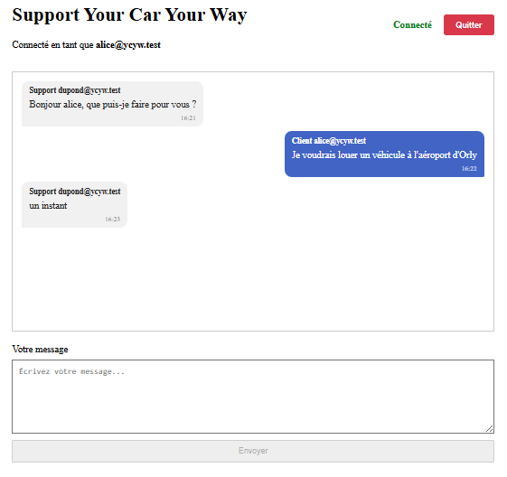
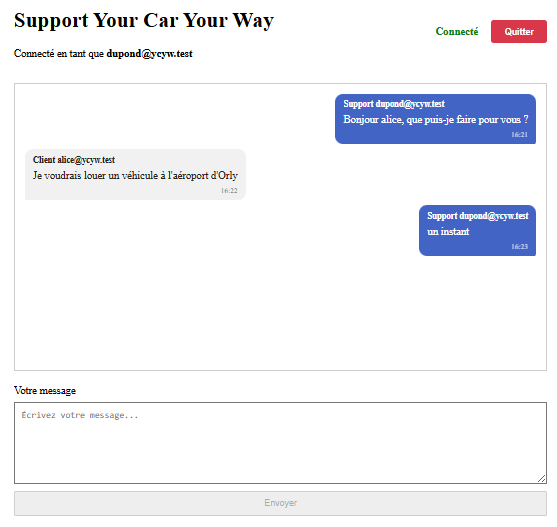
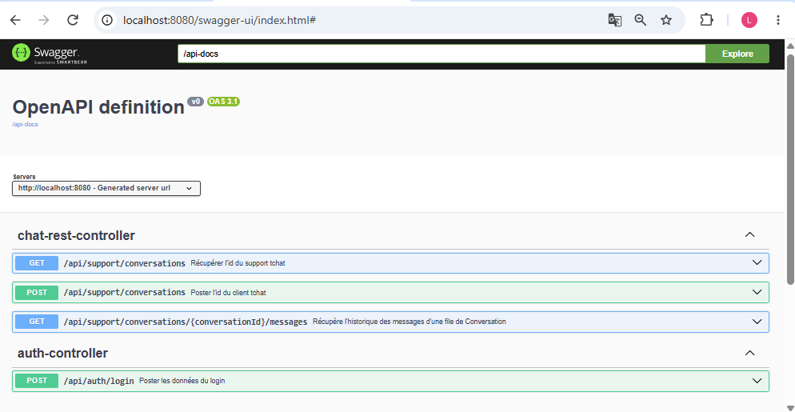

# YCYW Chat PoC

Proof of Concept du tchat temps réel de **Your Car Your Way (YCYW)**.

Ce projet a pour objectif de valider les choix techniques structurants de l'architecture cible :

**Angular → WebSocket/STOMP → Spring Boot → PostgreSQL**

Le PoC est volontairement limité au tchat. Il ne constitue pas une version complète de l'application YCYW.

---

## 1. Objectifs

Le PoC doit permettre de démontrer :

- la communication temps réel entre Angular et Spring Boot ;
- l'utilisation de WebSocket et STOMP ;
- la persistance des messages dans PostgreSQL ;
- la récupération de l'historique des messages ;
- la communication entre plusieurs clients ;
- une organisation du code compatible avec l'architecture cible ;
- un environnement de développement facilement reproductible.

---

## 2. Stack technique

| Technologie | Version          |
|---|------------------|
| Java | 21               |
| Spring Boot | 3.5.0            |
| Maven | 3.8.8            |
| Node.js | 20.19.4          |
| Angular | 21.2.22          |
| TypeScript | 5.9.3            |
| PostgreSQL | 17               |
| Docker | 29.1.3           |
| WebSocket | Spring WebSocket |
| STOMP | @stomp/stompjs   |
| ORM | Spring Data JPA  |

---

## 3. Architecture

```text
┌─────────────────────────┐
│       Angular 21        │
│                         │
│ Login                   │
│ Chat                    │
│ STOMP Client            │
└────────────┬────────────┘
             │
             │ HTTP / WebSocket
             ▼
┌─────────────────────────┐
│      Spring Boot        │
│                         │
│ REST                    │
│ WebSocket / STOMP       │
│ Services                │
│ JPA                     │
└────────────┬────────────┘
             │
             │ JDBC
             ▼
┌─────────────────────────┐
│      PostgreSQL 17      │
└─────────────────────────┘

---


```
## 4. Structure du projet

```
D:.
├───backend/                # Spring Boot API
│   └───src/
│   │    ├───main/
│   │    │   ├───java/
│   │    │   │   └───com/
│   │    │   │       └───ycyw/
│   │    │   │           └───chatpoc/
│   │    │   │               ├───auth/
│   │    │   │               │   ├───controller/
│   │    │   │               │   ├───dto/
│   │    │   │               │   ├───exception/
│   │    │   │               │   └───service/
│   │    │   │               ├───support/
│   │    │   │               │   ├───config/
│   │    │   │               │   ├───controller/
│   │    │   │               │   ├───dto/
│   │    │   │               │   ├───entity/
│   │    │   │               │   ├───repository/
│   │    │   │               │   └───service/
│   │    │   │               └───user/
│   │    │   │                   ├───entity/
│   │    │   │                   └───repository/
│   │    │   └───resources/
│   │    └───test/
│   │        ├───java/
│   │        │   └───com/
│   │        │       └───ycyw/
│   │        │           └───chatpoc/
│   │        └───resources/
│   ├── .env
│   └── pom.xml
│
├───frontend/            # Angular
│   ├───src/
│   │    │───app/
│   │    │   ├───auth/
│   │    │   ├───chat/
│   │    │   ├───core/
│   │    │   │   └───services/
│   │    │   │───home/
│   │    │   ├── app.component.ts
│   │    │   ├── app.config.ts
│   │    │   ├── app.css
│   │    │   ├── app.html
│   │    │   ├── app.spec.ts
│   │    │   └── app-routes.ts
│   │    ├── index.html
│   │    ├── main.ts
│   │    └── styles.scss 
│   ├── angular.json    
│   └── package.json
│
├── docs/                          # Documentation projet      
│   ├── cahier_des_charges.md
│   └── Dossier_Architecture.md
└── docker-compose.yml             # PostgreSQL 
```

## 5. Installation
```bash
git clone https://github.com/LeangOC/MyOC2_P10.git ycyw
cd ycyw
```

### Démarrer la base de données

```bash
docker compose up -d
```

PostgreSQL sera disponible sur `localhost:5432`.

###  Configurer le backend

```bash
cd backend
```

Éditer `.env` si nécessaire `) :


```env
DATABASE_URL=jdbc:postgresql://localhost:5432/ycyw_chat
DATABASE_USERNAME=ycyw
DATABASE_PASSWORD=dev_password

```

### Installer les dépendances frontend

```bash
cd ../frontend
npm install
```

---

## 6. Lancer le projet

Ouvrir **deux terminaux**.

**Terminal 1 - Backend**

```bash
cd backend
mvn spring-boot:run
```

API disponible sur `http://localhost:8080`


**Terminal 2 - Frontend**

```bash
cd frontend
ng serve --port 4000
```

Application disponible sur `http://localhost:4000`

---

## 7. Utiliser le tchat (mode démo)

Le POC simule une conversation entre deux rôles via deux onglets.

### Client ( Alice@ycyw.test )
1. Connexion `http://localhost:4000` → Entrer le login Email et le mot de passe
2. cliquer **Contacter le support**
3. Une fenêtre de conversation pour le client  



### Support ( Dupond@ycyw.test )
1. Connexion `http://localhost:4000` → Entrer le login Email et le mot de passe
2. Une fenêtre de conversation pour le client  


---


## 8. API REST
Base URL :

```text
http://localhost:8080/api

````
| Méthode | Endpoint                                           | Description                                            |
| ------- | -------------------------------------------------- | ------------------------------------------------------ |
| `GET`   | `/support/conversations`                           | Récupérer les conversations du support                 |
| `POST`  | `/support/conversations`                           | Créer une conversation pour un client                  |
| `GET`   | `/support/conversations/{conversationId}/messages` | Récupérer l'historique des messages d'une conversation |
| `POST`  | `/auth/login`                                      | Authentifier un utilisateur                            |


La documentation complète (schémas, exemples) est disponible sur **Swagger UI** :
`http://localhost:8080/swagger-ui.html`:  


---


## 9. WebSocket / STOMP

L'application utilise **WebSocket** pour établir une connexion persistante entre le client Angular et le serveur Spring Boot.

**STOMP (Simple Text Oriented Messaging Protocol)** est utilisé au-dessus de WebSocket pour structurer les échanges de messages.

### Point de connexion

```text
ws://localhost:8080/ws-chat
````

### Préfixes STOMP

* `/app` : destination des messages envoyés par le client vers les méthodes du serveur Spring Boot (`@MessageMapping`).
* `/topic` : destination des messages diffusés par le broker aux clients abonnés.

### Destinations utilisées

| Type          | Destination                             | Description                                            |
| ------------- | --------------------------------------- | ------------------------------------------------------ |
| **Subscribe** | `/topic/conversations/{conversationId}` | Recevoir les messages et événements de la conversation |
| **Publish**   | `/app/chat`                             | Envoyer un message dans une conversation               |
| **Publish**   | `/app/chat/leave`                       | Signaler qu'un client quitte la conversation           |


### Le schéma à retenir

```text
                    WebSocket
Angular  ──────────────────────────► Spring Boot
         ws://localhost:8080/ws-chat

                    STOMP

Client ── SEND ──► /app/chat                   # Le client publie avec json {"conversationId": 62,"senderId": 4,"content": "Bonjour"}
                         │
                         ▼
                  ChatWebSocketController
                         │
                         ▼
              messagingTemplate
                         │
                         ▼
Client ◄─ MESSAGE ─ /topic/conversations/{id}    # Le serveur diffuse la réponse aux clients abonnés à conversationId=62


Client ── SEND ──► /app/chat/leave               # Lorsqu'un client quitte la conversation, 
                         │                       # le client publie sur { "conversationId": 62}
                         ▼
                  Ferme la conversation
                         │
                         ▼
Client ◄─ MESSAGE ─ /topic/conversations/{id}    # Le serveur ferme alors la conversation et diffuse l'événement  
                  CONVERSATION_CLOSED            # avec {"type": "CONVERSATION_CLOSED","conversationId": 62}
```


---

## 10. Tables utilisées pour notre Tchat PoC

| Schema     | Name                 | Type     |
| -----------|----------------------|----------|
| **public** | `chat_conversations` | table    |
| **public** | `chat_messages`      | table    |
| **public** | `users`              | table    |

Ces trois tables sont créés automatiquement lors du démarrage de Backend grâce aux entités.


> **Sécurité** : le fichier `.env` contient vos identifiants de base de données - ne le commitez jamais. 


## 11. Documentation

| Document                                                   | Contenu                                                                  |
|------------------------------------------------------------|--------------------------------------------------------------------------|
| [`docs/Dossier_Architecture.md`](docs/architecture.md)     | Architecture cible complète, audit de l'existant, UML, modèle de données |
| [`docs/cahier_des_charges.md`](docs/cahier_des_charges.md) | Spécifications fonctionnelles,scénario d'utilisateur, règles métier       |

